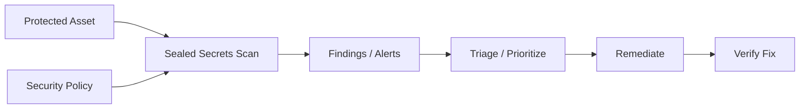

# Sealed Secrets & External Secrets — A 2-Day Crash Course

Two solutions for storing Kubernetes secrets safely in Git — Sealed Secrets encrypts them client-side so only your cluster can decrypt them, while External Secrets Operator syncs secrets from external stores like Vault, AWS Secrets Manager, or GCP Secret Manager into your cluster at runtime.

---

## Part 0 — Why This Problem Exists

Kubernetes Secrets look secure. They're not. A Secret manifest is just base64-encoded data:

```yaml
apiVersion: v1
kind: Secret
metadata:
  name: db-password
data:
  password: c3VwZXJzZWNyZXQ=   # echo -n "supersecret" | base64
```

Anyone who can `base64 -d` that string has your password in plaintext. There is no encryption, no access control baked into the format — base64 is encoding, not encryption.

Now consider GitOps: Argo CD and Flux both expect everything in Git. The cluster reconciles from Git. If you can't put Secrets in Git, you've created a second source of truth — manual `kubectl apply` for secrets, Git for everything else. That breaks the whole model.

The options people typically reach for:

- Commit base64 Secrets to Git — catastrophic, especially in a shared or public repo.
- Never commit Secrets, apply them out-of-band — GitOps discipline breaks immediately.
- Use a secret manager (Vault, AWS, GCP) — solid, but you still need a bridge into the cluster.

Sealed Secrets and External Secrets Operator are the two most widely adopted bridges.

---

## Vocabulary

**SealedSecret** — A Kubernetes custom resource (CRD) that holds an asymmetrically encrypted version of your Secret. It is safe to commit to Git because only the controller in your cluster can decrypt it.

**kubeseal** — The CLI tool you run on your laptop. It contacts the Sealed Secrets controller (or uses a downloaded public key) to encrypt a plain Secret into a SealedSecret. You never commit the plain Secret.

**Encryption Key** — An RSA key pair auto-generated by the Sealed Secrets controller. The public key encrypts (used by kubeseal). The private key decrypts (held only inside the cluster). Key rotation means generating a new pair — old seals remain valid as long as you don't delete old private keys.

**External Secrets Operator (ESO)** — A Kubernetes operator that reads credentials from external secret stores and writes them as native Kubernetes Secrets into your cluster. The external store is the source of truth; ESO is the sync layer.

**SecretStore** — A namespaced ESO CRD that defines how to connect to one secret backend (Vault, AWS, GCP, Azure, etc.) and which credentials to use for that connection. Scoped to one namespace.

**ClusterSecretStore** — The cluster-scoped version of SecretStore. Define it once, reference it from any namespace. Useful for shared backends in multi-tenant clusters.

**ExternalSecret** — A namespaced ESO CRD that says "pull secret X from this SecretStore and write it as a Kubernetes Secret named Y in this namespace." ESO reconciles it on a configurable interval.

---




## DAY 1 — Sealed Secrets

### 1.1 How It Works

```
You                 Cluster
----                -------
kubectl create secret generic ... --dry-run=client -o yaml
    |
    v
kubeseal  ----public key----->  SealedSecret (encrypted YAML)
    |                                 |
  commit to Git                       |
                                      |
                    ArgoCD / Flux applies SealedSecret to cluster
                                      |
                    Sealed Secrets controller decrypts it
                                      |
                    Native Kubernetes Secret created in-cluster
```

The private key never leaves the cluster. Your Git repo only ever sees ciphertext.

### 1.2 Install the Controller

Using Helm:

```bash
helm repo add sealed-secrets https://bitnami-labs.github.io/sealed-secrets
helm repo update

helm install sealed-secrets sealed-secrets/sealed-secrets \
  --namespace kube-system \
  --set fullnameOverride=sealed-secrets-controller
```

Verify:

```bash
kubectl get pods -n kube-system | grep sealed-secrets
kubectl get crd | grep sealedsecrets
```

### 1.3 Install kubeseal

macOS:

```bash
brew install kubeseal
```

Linux:

```bash
KUBESEAL_VERSION=$(curl -s https://api.github.com/repos/bitnami-labs/sealed-secrets/releases/latest \
  | jq -r '.tag_name' | sed 's/v//')
wget https://github.com/bitnami-labs/sealed-secrets/releases/download/v${KUBESEAL_VERSION}/kubeseal-${KUBESEAL_VERSION}-linux-amd64.tar.gz
tar xfz kubeseal-${KUBESEAL_VERSION}-linux-amd64.tar.gz
sudo install -m 755 kubeseal /usr/local/bin/kubeseal
```

### 1.4 Seal Your First Secret

Create the plain Secret without applying it:

```bash
kubectl create secret generic db-creds \
  --from-literal=username=admin \
  --from-literal=password=supersecret \
  --namespace=production \
  --dry-run=client \
  -o yaml > /tmp/db-creds.yaml
```

⚠️ Never commit `/tmp/db-creds.yaml`. It is plaintext.

Seal it:

```bash
kubeseal \
  --controller-name=sealed-secrets-controller \
  --controller-namespace=kube-system \
  --format yaml \
  < /tmp/db-creds.yaml \
  > sealed-db-creds.yaml
```

Inspect `sealed-db-creds.yaml` — you'll see encrypted blobs under `spec.encryptedData`. This file is safe to commit.

```bash
git add sealed-db-creds.yaml
git commit -m "feat: add sealed db credentials for production"
```

### 1.5 ArgoCD or Flux Applies It

With ArgoCD, your Application manifest points at the Git repo. When ArgoCD syncs, it applies the SealedSecret. The controller running in the cluster decrypts it and creates the native Secret.

With Flux, a `Kustomization` or `HelmRelease` picks it up the same way — no special configuration needed. Flux and ArgoCD both treat SealedSecrets as ordinary Kubernetes resources.

### 1.6 Scope — Namespace and Name Binding

By default, a SealedSecret is bound to the namespace and name specified at seal time. If you try to apply it in a different namespace or rename it, decryption fails. This is intentional — it prevents an attacker from moving a sealed secret to a namespace they control.

You can loosen this with the `--scope` flag:

```bash
kubeseal --scope cluster-wide ...    # any namespace, any name
kubeseal --scope namespace-wide ...  # any name in the same namespace
kubeseal --scope strict ...          # default: exact namespace + name match
```

Use `strict` scope in production. Looser scopes are useful for templating but reduce the security guarantee.

### 1.7 Offline Sealing

If you don't have cluster access (CI pipeline, developer laptop disconnected):

```bash
# Download the public key once and store it safely (not in Git)
kubeseal --fetch-cert \
  --controller-name=sealed-secrets-controller \
  --controller-namespace=kube-system \
  > pub-cert.pem

# Seal offline using the cert
kubeseal --cert pub-cert.pem --format yaml < secret.yaml > sealed-secret.yaml
```

Keep the public cert accessible to your CI system. It is not sensitive — it's a public key.

### 1.8 Key Rotation

The controller generates a new key pair every 30 days by default. Old private keys are retained so old SealedSecrets continue to work. New seals use the latest public key.

To force rotation:

```bash
kubectl label secret \
  -n kube-system \
  -l sealedsecrets.bitnami.com/sealed-secrets-key=active \
  sealedsecrets.bitnami.com/sealed-secrets-key=compromised
```

After rotation, re-seal all your secrets with the new public key and commit the updated SealedSecrets. This is the recommended response to a key compromise.

⚠️ Back up the private keys. If the controller pod is deleted and the keys are lost, no SealedSecrets in your repo can be decrypted. You have to recreate all secrets from their original sources. Export them:

```bash
kubectl get secret \
  -n kube-system \
  -l sealedsecrets.bitnami.com/sealed-secrets-key \
  -o yaml > sealed-secrets-keys-backup.yaml
```

Store this backup outside the cluster — in Vault, AWS Secrets Manager, or encrypted storage. Not in the same Git repo.

---

## DAY 2 — External Secrets Operator

### 2.1 Why ESO

Sealed Secrets solves the "Git is safe" problem but doesn't give you dynamic rotation — once sealed, the value is static until you re-seal and redeploy. It also doesn't integrate with your existing secret management infrastructure.

ESO flips the model: your secret store (Vault, AWS, GCP, Azure, 1Password) is the source of truth. ESO watches ExternalSecret resources and pulls the current secret value into the cluster on a schedule. When the secret rotates in Vault, ESO picks it up within the refresh interval.

### 2.2 Install ESO

```bash
helm repo add external-secrets https://charts.external-secrets.io
helm repo update

helm install external-secrets external-secrets/external-secrets \
  --namespace external-secrets \
  --create-namespace \
  --set installCRDs=true
```

Verify:

```bash
kubectl get pods -n external-secrets
kubectl get crd | grep externalsecrets
```

You should see three CRDs: `externalsecrets`, `secretstores`, `clustersecretstores`.

### 2.3 SecretStore — Connecting to Vault

First, give ESO credentials to access Vault. A common pattern is a Kubernetes ServiceAccount with Vault's Kubernetes auth method:

```yaml
apiVersion: v1
kind: ServiceAccount
metadata:
  name: eso-vault-auth
  namespace: production
```

Configure Vault to trust that ServiceAccount (see `Vault.md`). Then create the SecretStore:

```yaml
apiVersion: external-secrets.io/v1beta1
kind: SecretStore
metadata:
  name: vault-backend
  namespace: production
spec:
  provider:
    vault:
      server: "https://vault.internal:8200"
      path: "secret"
      version: "v2"
      auth:
        kubernetes:
          mountPath: "kubernetes"
          role: "eso-production-role"
          serviceAccountRef:
            name: eso-vault-auth
```

### 2.4 SecretStore — AWS Secrets Manager

```yaml
apiVersion: external-secrets.io/v1beta1
kind: SecretStore
metadata:
  name: aws-secrets-manager
  namespace: production
spec:
  provider:
    aws:
      service: SecretsManager
      region: us-east-1
      auth:
        jwt:
          serviceAccountRef:
            name: eso-aws-auth   # IRSA-annotated ServiceAccount
```

For AWS, use IRSA (IAM Roles for Service Accounts) rather than static credentials. Annotate the ServiceAccount with the IAM role ARN:

```yaml
apiVersion: v1
kind: ServiceAccount
metadata:
  name: eso-aws-auth
  namespace: production
  annotations:
    eks.amazonaws.com/role-arn: arn:aws:iam::123456789012:role/eso-production-role
```

### 2.5 SecretStore — GCP Secret Manager

```yaml
apiVersion: external-secrets.io/v1beta1
kind: SecretStore
metadata:
  name: gcp-secrets
  namespace: production
spec:
  provider:
    gcpsm:
      projectID: my-gcp-project
      auth:
        workloadIdentity:
          clusterLocation: us-central1
          clusterName: my-cluster
          serviceAccountRef:
            name: eso-gcp-auth
```

Use Workload Identity on GKE rather than exporting a service account key file.

### 2.6 ExternalSecret — Pull a Secret

```yaml
apiVersion: external-secrets.io/v1beta1
kind: ExternalSecret
metadata:
  name: db-credentials
  namespace: production
spec:
  refreshInterval: 1h
  secretStoreRef:
    name: vault-backend
    kind: SecretStore
  target:
    name: db-creds          # the Kubernetes Secret ESO will create/update
    creationPolicy: Owner
  data:
    - secretKey: username   # key in the resulting Kubernetes Secret
      remoteRef:
        key: production/db  # path in Vault
        property: username  # field within the Vault secret
    - secretKey: password
      remoteRef:
        key: production/db
        property: password
```

Apply this manifest to Git. ESO reconciles it every hour — fetching current values from Vault and writing them into the `db-creds` Secret in the `production` namespace.

### 2.7 ClusterSecretStore — Multi-Tenant Pattern

If multiple teams share a cluster and all need to reach the same Vault, define a ClusterSecretStore once:

```yaml
apiVersion: external-secrets.io/v1beta1
kind: ClusterSecretStore
metadata:
  name: shared-vault
spec:
  provider:
    vault:
      server: "https://vault.internal:8200"
      path: "secret"
      version: "v2"
      auth:
        kubernetes:
          mountPath: "kubernetes"
          role: "eso-cluster-role"
          serviceAccountRef:
            name: eso-vault-auth
            namespace: external-secrets
```

Teams reference it in their ExternalSecrets:

```yaml
secretStoreRef:
  name: shared-vault
  kind: ClusterSecretStore
```

Each team still controls their own ExternalSecret resources and Vault paths. The ClusterSecretStore provides the transport layer — not shared access to all secrets.

### 2.8 Rotation and Drift Detection

ESO re-syncs on the `refreshInterval`. Set it based on your secret rotation cadence:

- Static secrets (API keys changed rarely) — `24h` or `12h` is fine.
- Dynamically rotated secrets (Vault dynamic credentials) — `5m` or `15m`.
- Database credentials with short TTLs — match your lease duration, stay well under it.

ESO emits events and updates the ExternalSecret status. Check sync health:

```bash
kubectl get externalsecret -n production
# Look at READY and STATUS columns

kubectl describe externalsecret db-credentials -n production
# Conditions block shows last sync time and any errors
```

---

## Sealed Secrets vs ESO vs SOPS

| | Sealed Secrets | External Secrets Operator | SOPS |
|---|---|---|---|
| Secret location | Encrypted in Git | External store (Vault, AWS, GCP) | Encrypted in Git |
| Decryption happens | In-cluster (controller) | In-cluster (ESO pulls from store) | Client-side (at apply time) |
| Dynamic rotation | No — re-seal required | Yes — automatic on refresh interval | No — re-encrypt and redeploy |
| External store needed | No | Yes | No (but can use KMS) |
| GitOps compatible | Yes | Yes (only ESO manifests in Git) | Yes |
| Complexity | Low | Medium | Low–Medium |
| Key management | Controller-managed RSA | Delegated to secret store | KMS key or GPG key |
| Best for | Simple clusters, no external store | Enterprise, dynamic rotation, Vault/cloud native | Helm values, Terraform state, mixed toolchains |

**Use Sealed Secrets when:**
- You have no existing secret management infrastructure.
- Your secrets rarely rotate.
- You want the simplest possible setup — one controller, one CLI tool.
- You're a small team without Vault.

**Use ESO when:**
- You already run Vault, AWS Secrets Manager, or GCP Secret Manager.
- You need automatic rotation to propagate into the cluster.
- You're operating at scale with multiple teams and namespaces.
- Compliance requires the canonical secret to live outside Kubernetes.

**Use SOPS when:**
- You're managing Helm values files or Terraform vars alongside Kubernetes manifests.
- You prefer file-level encryption with GPG or cloud KMS keys.
- You want encryption that works without running a controller.

You can combine them — many teams use Sealed Secrets for bootstrap secrets (the credentials ESO needs to connect to Vault) and ESO for everything else.

---

## Worked Example — GitOps Secrets Pipeline with ESO + Vault

Goal: a `production` namespace application that needs a database password. Vault is the source of truth. ArgoCD manages the cluster.

**Step 1 — Store the secret in Vault:**

```bash
vault kv put secret/production/db \
  username=appuser \
  password=correct-horse-battery-staple
```

**Step 2 — Commit ESO resources to Git:**

`gitops/production/secret-store.yaml`:

```yaml
apiVersion: external-secrets.io/v1beta1
kind: SecretStore
metadata:
  name: vault-backend
  namespace: production
spec:
  provider:
    vault:
      server: "https://vault.internal:8200"
      path: "secret"
      version: "v2"
      auth:
        kubernetes:
          mountPath: "kubernetes"
          role: "eso-production-role"
          serviceAccountRef:
            name: eso-vault-auth
```

`gitops/production/external-secret-db.yaml`:

```yaml
apiVersion: external-secrets.io/v1beta1
kind: ExternalSecret
metadata:
  name: db-credentials
  namespace: production
spec:
  refreshInterval: 1h
  secretStoreRef:
    name: vault-backend
    kind: SecretStore
  target:
    name: db-creds
    creationPolicy: Owner
  data:
    - secretKey: username
      remoteRef:
        key: production/db
        property: username
    - secretKey: password
      remoteRef:
        key: production/db
        property: password
```

**Step 3 — ArgoCD syncs:**

ArgoCD applies both manifests. ESO immediately reconciles the ExternalSecret, contacts Vault, and writes the `db-creds` Secret into the `production` namespace.

**Step 4 — Application uses the Secret:**

```yaml
env:
  - name: DB_PASSWORD
    valueFrom:
      secretKeyRef:
        name: db-creds
        key: password
```

**Step 5 — Rotate in Vault:**

```bash
vault kv put secret/production/db \
  username=appuser \
  password=new-rotated-password
```

Within the `refreshInterval`, ESO updates `db-creds`. Your application picks it up on its next read — or after a pod restart if it caches the value at startup.

---

## Pitfalls

**Losing the Sealed Secrets private key.** If you delete the controller and lose the key backup, every SealedSecret in Git is permanently unreadable. You have to recreate all secrets from their original sources and re-seal them. Always back up the key pair immediately after controller install.

**Re-sealing after key rotation is manual.** The controller rotates keys automatically, but your SealedSecrets in Git still use the old public key. Old seals continue to work — but if someone compromises the old private key, you need to re-seal everything with the new key. There is no automated bulk re-sealing tool; script it yourself.

**refreshInterval too short on ESO.** Setting `refreshInterval: 30s` on dozens of ExternalSecrets across hundreds of namespaces will hammer your secret backend with API calls. Use longer intervals for stable secrets and shorter ones only where rotation cadence demands it.

**SecretStore auth credentials in a plain Secret.** If ESO needs a static token to authenticate to Vault, that token lives in a Kubernetes Secret. You're back to the original problem for that one credential. Use Kubernetes auth (IRSA, Workload Identity, pod identity) instead of static credentials wherever the platform supports it.

**creationPolicy: Owner vs Merge vs None.** With `Owner` (default), ESO deletes the Kubernetes Secret if the ExternalSecret is deleted. With `Merge`, ESO updates an existing Secret but won't delete it. With `None`, ESO never manages the Secret lifecycle. `Owner` is usually correct — `Merge` is useful when multiple ExternalSecrets populate different keys into one Secret.

**Namespace scope on SealedSecrets.** If you seal a secret for namespace `staging` and apply it in `production`, decryption silently produces garbage. The controller creates the Kubernetes Secret but the values are unreadable. Check scope first when troubleshooting unexpected auth failures.

**ESO and ArgoCD out-of-sync warnings.** ESO creates and updates Kubernetes Secrets, but ArgoCD sees the resulting Secret as a resource not tracked in Git — it may flag it as `OutOfSync`. Configure ArgoCD to ignore differences on Secret resources managed by ESO, or use the `argocd.argoproj.io/managed-by` annotation to suppress the drift warning.

---

## Quick Reference

```bash
# Seal a secret
kubeseal --format yaml < plain-secret.yaml > sealed-secret.yaml

# Fetch public cert for offline sealing
kubeseal --fetch-cert \
  --controller-name=sealed-secrets-controller \
  --controller-namespace=kube-system \
  > pub-cert.pem

# Seal offline
kubeseal --cert pub-cert.pem --format yaml < plain-secret.yaml > sealed-secret.yaml

# Check SealedSecret status
kubectl get sealedsecret -n production
kubectl describe sealedsecret db-creds -n production

# Check ESO ExternalSecret status
kubectl get externalsecret -n production
kubectl describe externalsecret db-credentials -n production

# Force ESO to re-sync immediately
kubectl annotate externalsecret db-credentials \
  -n production \
  force-sync=$(date +%s) \
  --overwrite

# Back up Sealed Secrets private keys
kubectl get secret \
  -n kube-system \
  -l sealedsecrets.bitnami.com/sealed-secrets-key \
  -o yaml > sealed-secrets-keys-backup.yaml

# List all SecretStores and ClusterSecretStores
kubectl get secretstore -A
kubectl get clustersecretstore

# Check ESO controller logs
kubectl logs -n external-secrets \
  -l app.kubernetes.io/name=external-secrets \
  --tail=50
```

---


## Top 10 Interview Questions

<details>
<summary><strong>Q: What is Sealed Secrets and what problem does it solve?</strong></summary>

Sealed Secrets addresses a specific need in modern engineering workflows. Understanding the core problem it solves — and the alternatives it replaced — is the foundation for every subsequent interview question. Frame your answer around the pain point first, then the solution.

</details>

<details>
<summary><strong>Q: How does Sealed Secrets compare to its main alternatives?</strong></summary>

Every tool exists in an ecosystem of alternatives. Be prepared to articulate the specific tradeoffs: when Sealed Secrets is the right choice, when an alternative is better, and what factors drive the decision (scale, team expertise, existing infrastructure, compliance requirements).

</details>

<details>
<summary><strong>Q: What are the most common production pitfalls with Sealed Secrets?</strong></summary>

Production experience is what separates senior from junior engineers. Common pitfalls include: misconfiguration that works in dev but fails at scale, security oversights, inadequate monitoring, and operational procedures that are untested until an incident occurs. Cite specific examples from your experience.

</details>

<details>
<summary><strong>Q: How do you monitor and observe Sealed Secrets in production?</strong></summary>

Key metrics to track, alerting thresholds to set, dashboards to build, and log patterns to watch. Production monitoring should cover: health/liveness, performance (latency, throughput), capacity (resource utilisation), and business impact (error rates affecting users). Explain which metrics are leading indicators versus lagging.

</details>

<details>
<summary><strong>Q: How do you scale Sealed Secrets as load increases?</strong></summary>

Scaling strategies depend on the bottleneck: horizontal scaling (add more instances), vertical scaling (bigger instances), caching (reduce load), sharding (distribute data), and async processing (decouple components). Explain which approach applies to Sealed Secrets and at what scale each strategy becomes necessary.

</details>

<details>
<summary><strong>Q: How do you handle security and access control with Sealed Secrets?</strong></summary>

Security is non-negotiable in production. Cover: authentication and authorization mechanisms, secrets management (never in code), encryption (at rest and in transit), network security (firewalls, private networks), audit logging, and compliance requirements relevant to your industry.

</details>

<details>
<summary><strong>Q: How do you implement disaster recovery for Sealed Secrets?</strong></summary>

DR planning requires defining RTO (recovery time objective) and RPO (recovery point objective), implementing backup strategies, testing restore procedures, and documenting runbooks. Explain your backup strategy, how you test restores, and what your recovery procedure looks like.

</details>

<details>
<summary><strong>Q: How do you automate Sealed Secrets deployment and configuration management?</strong></summary>

Infrastructure as code, CI/CD pipelines, configuration management, and GitOps workflows. Explain how you version, test, deploy, and roll back changes. Cover: what is automated, what requires manual approval, and how you handle configuration drift.

</details>

<details>
<summary><strong>Q: How do you troubleshoot issues with Sealed Secrets in production?</strong></summary>

A systematic debugging approach: check health endpoints, review recent changes (deploys, config changes), examine logs and metrics, reproduce the issue, identify root cause, fix, verify, and write a postmortem. Explain your actual debugging workflow with concrete examples.

</details>

<details>
<summary><strong>Q: What are the best practices for Sealed Secrets that you have learned from experience?</strong></summary>

Best practices that go beyond documentation: lessons learned from production incidents, configuration patterns that prevent common issues, testing strategies that catch bugs before production, and operational procedures that reduce toil. Share specific examples where following (or not following) a best practice had measurable impact.

</details>

---


## Quick Quiz

Test your understanding with these rapid-fire questions (answers hidden):

<details>
<summary>1. What is the ONE core problem that Sealed Secrets solves?</summary>
Re-read Part 0 — the mental model section. If you can explain the "why" in one sentence, you understand the foundation.
</details>

<details>
<summary>2. Name the 3 most important terms from the vocabulary section.</summary>
Review Part 1. These are the building blocks every conversation about Sealed Secrets uses.
</details>

<details>
<summary>3. What is the first thing you would set up on Day 1?</summary>
Check the Day 1 section — the very first hands-on step that gets you a working result.
</details>

<details>
<summary>4. What is the most common production pitfall with Sealed Secrets?</summary>
Review the Common Pitfalls section. The first item listed is typically the most frequently encountered.
</details>

<details>
<summary>5. How does Sealed Secrets compare to its closest alternative?</summary>
Check the Comparison Matrix below — focus on the key differentiating row.
</details>


## Comparison Matrix

| Dimension | Sealed Secrets | External Secrets | SOPS |
|-----------|----------------|------------------|------|
| **Primary use case** | Core strength of Sealed Secrets | Core strength of External Secrets | Core strength of SOPS |
| **Learning curve** | Moderate | Varies | Varies |
| **Community/ecosystem** | Active | Active | Growing |
| **Operational complexity** | Medium | Varies | Varies |
| **Best for** | See Part 0 | Different tradeoffs | Different tradeoffs |

> **How to read this matrix:** no tool wins on every dimension. Pick based on your specific constraints — team expertise, existing infrastructure, scale requirements, and compliance needs. The right choice is the one that fits your context, not the one with the most checkmarks.

## Next Steps

- `Vault.md` — setting up Vault, Kubernetes auth, dynamic secrets, and secret engines
- `Kubernetes.md` — RBAC, namespaces, and how Secrets integrate with workloads
- `ArgoCD.md` — GitOps sync strategies, app-of-apps, and managing ESO resources through ArgoCD
- `Git.md` — branch protection, signed commits, and keeping secrets out of Git history

---

## Recommended learning resources

**YouTube channels & playlists:**
- [CNCF — Sealed Secrets and Kubernetes Secrets Management](https://www.youtube.com/@cncf) — KubeCon talks on encrypting secrets for GitOps workflows
- [TechWorld with Nana — Kubernetes Secrets](https://www.youtube.com/@TechWorldwithNana) — practical walkthrough of Sealed Secrets with Flux and ArgoCD
- [John Hammond — Secrets in Kubernetes](https://www.youtube.com/@_JohnHammond) — security-focused demonstration of why base64 is not encryption and how Sealed Secrets solves it
- [That DevOps Guy — Sealed Secrets Tutorial](https://www.youtube.com/@yourdevopsguy) — step-by-step setup of the controller, kubeseal CLI, and key rotation
- [Snyk — Kubernetes Security](https://www.youtube.com/@Snyksec) — broader context on secrets management, RBAC, and securing the Kubernetes supply chain

**Official docs & blogs:**
- [Sealed Secrets GitHub Repository](https://github.com/bitnami-labs/sealed-secrets) — installation, usage, key management, and architecture documentation
- [Bitnami Blog — Sealed Secrets](https://engineering.bitnami.com/) — the original design rationale and production deployment patterns
- [OWASP — Secrets Management Cheat Sheet](https://cheatsheetseries.owasp.org/cheatsheets/Secrets_Management_Cheat_Sheet.html) — broader framework for secrets handling that Sealed Secrets fits into

---

## The Mantra

> Encrypt before commit, sync from the source of truth, never trust base64.

Kubernetes Secrets are not secrets — they're just encoded. Your cluster's security posture starts the moment you decide where the actual encryption boundary lives. Sealed Secrets moves that boundary into Git, where it belongs when you have no external store. ESO moves it into a dedicated secret manager, where it belongs when you do. Either way, the goal is the same: no plaintext credentials in version control, no manual out-of-band secret management, and a clear audit trail for every change.
