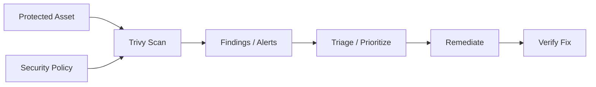

# Trivy — A 2-Day Crash Course

> **In one sentence:** Trivy is an all-in-one security scanner that finds vulnerabilities, misconfigurations, and secrets in container images, filesystems, IaC, and Git repos — one tool to scan everything.

---

## Part 0 — Why Trivy exists

Before Trivy, securing a container-based pipeline meant stitching together four or five separate tools: one to scan Docker images for CVEs, another to check Terraform for misconfigurations, a third to hunt secrets in source code, maybe a fourth to produce an SBOM. Each tool had its own output format, update cadence, and CI integration. The cognitive overhead was real, and gaps between tools were exploited — supply chain attacks like the SolarWinds and Log4Shell incidents proved that vulnerabilities hiding in base images, transitive dependencies, and committed secrets cause serious damage.

Trivy collapses that toolchain. One binary. One CLI interface. One output format. It understands container images, filesystems, Git repositories, Kubernetes manifests, Terraform, Helm charts, Dockerfiles, and more. It ships with its own vulnerability database (pulled from NVD, Red Hat, Alpine, Debian, Ubuntu, and others) and updates it automatically.

The reason this matters operationally: you can wire one `trivy` call into your CI pipeline and catch CVEs in your base image, hardcoded AWS keys in your source code, and misconfigured S3 buckets in your Terraform — all before a single byte reaches production.

**Mental model:** Trivy is a metal detector you walk your artifacts through — images, code, configs, repos — and it beeps on anything dangerous. You decide the sensitivity level; it tells you exactly what it found and where.

---




## Part 1 — The vocabulary

| Term | What it means |
|---|---|
| **CVE** | Common Vulnerabilities and Exposures — a unique identifier (e.g., `CVE-2021-44228`) assigned to a known vulnerability. The global standard reference. |
| **CVSS** | Common Vulnerability Scoring System — a 0–10 numeric score representing severity. CVSS v3 is the current standard. Above 9.0 is CRITICAL. |
| **Vulnerability** | A known weakness in a software package that can be exploited. Trivy maps installed packages to CVEs in its database. |
| **Misconfiguration** | An insecure setting in infrastructure code or container config — e.g., a Kubernetes pod running as root, or an S3 bucket with public access enabled. |
| **Secret** | A credential, API key, private key, or token found in source code, config files, or image layers. Trivy detects these with regex and entropy checks. |
| **SBOM** | Software Bill of Materials — a machine-readable inventory of every package and dependency in an artifact. Think of it as a manifest of ingredients. |
| **VEX** | Vulnerability Exploitability eXchange — metadata that lets you assert "this CVE affects this package but is NOT exploitable in our context." Used to suppress known false positives formally. |
| **Severity** | Trivy classifies findings as CRITICAL, HIGH, MEDIUM, LOW, or UNKNOWN — derived from CVSS score and vendor-specific advisories. |
| **Scanner** | The specific check type Trivy runs: `vuln` (package CVEs), `config` (misconfigurations), `secret` (credentials), `license` (license compliance). |
| **Target** | What Trivy is scanning: `image`, `fs`, `repo`, `config`, `rootfs`, `sbom`, `kubernetes`. |

---

## DAY 1 — Scan everything

### 1. Install Trivy

On macOS:

```bash
brew install aquasecurity/trivy/trivy
```

On Linux (Debian/Ubuntu):

```bash
sudo apt-get install wget apt-transport-https gnupg lsb-release
wget -qO - https://aquasecurity.github.io/trivy-repo/deb/public.key | sudo apt-key add -
echo deb https://aquasecurity.github.io/trivy-repo/deb $(lsb_release -sc) main | sudo tee -a /etc/apt/sources.list.d/trivy.list
sudo apt-get update && sudo apt-get install trivy
```

Via Docker (no install required):

```bash
docker run --rm aquasec/trivy:latest image alpine:3.18
```

Verify:

```bash
trivy --version
```

Update the vulnerability database before your first real scan — Trivy does this automatically on first run, but you can force it:

```bash
trivy image --download-db-only
```

### 2. Scan a container image

The most common use case. Pull a public image and scan it:

```bash
trivy image nginx:1.25
```

Trivy will pull the image if it's not local, extract its layers, identify installed packages, and cross-reference against its vulnerability database. The output shows each vulnerable package, the CVE ID, severity, installed version, and the fixed version (if one exists).

Scan a locally built image by tag:

```bash
docker build -t myapp:dev .
trivy image myapp:dev
```

Scan an image tarball (useful in air-gapped pipelines):

```bash
docker save myapp:dev -o myapp.tar
trivy image --input myapp.tar
```

### 3. Scan a filesystem

When you want to scan source code, a build artifact directory, or the host filesystem rather than a container image:

```bash
trivy fs /path/to/project
```

This scans for:
- Vulnerable packages declared in `package.json`, `go.mod`, `requirements.txt`, `Gemfile.lock`, `pom.xml`, and more
- Secrets in files
- Misconfigurations in IaC files it finds

Scan only for vulnerabilities (skip other scanners):

```bash
trivy fs --scanners vuln /path/to/project
```

### 4. Scan IaC — Terraform and Kubernetes manifests

Point Trivy at a directory containing `.tf` files or Kubernetes YAML:

```bash
# Terraform
trivy config ./terraform/

# Kubernetes manifests
trivy config ./k8s/

# Mixed directory — Trivy detects file types automatically
trivy config ./infra/
```

Trivy checks against its built-in policy library (based on Open Policy Agent rules). It flags things like:

- Containers running as root
- Missing resource limits on pods
- Publicly accessible S3 buckets
- Security groups open to `0.0.0.0/0`
- Missing encryption on RDS instances

Cross-reference `Terraform.md` and `Kubernetes.md` for the infrastructure patterns these checks apply to.

### 5. Scan for secrets

Trivy's secret scanner runs over file contents looking for high-entropy strings and known credential patterns (AWS keys, GitHub tokens, private keys, etc.):

```bash
trivy fs --scanners secret /path/to/project
```

To scan a Git repository including its history:

```bash
trivy repo https://github.com/your-org/your-repo
```

Scanning repo history is important — a secret committed and immediately deleted is still in the Git object store and extractable. Trivy's repo scanner checks commit history by default.

### 6. Reading the output

Default output is a table. Here is how to parse it:

```
nginx:1.25 (debian 12.2)
=======================
Total: 87 (UNKNOWN: 0, LOW: 45, MEDIUM: 28, HIGH: 11, CRITICAL: 3)

┌──────────────┬────────────────┬──────────┬──────────┬──────────────┬──────────────────┬──────────────────────────────────┐
│   Library    │ Vulnerability  │ Severity │  Status  │   Installed  │    Fixed Version │              Title               │
├──────────────┼────────────────┼──────────┼──────────┼──────────────┼──────────────────┼──────────────────────────────────┤
│ openssl      │ CVE-2023-XXXX  │ CRITICAL │  fixed   │ 3.0.8-1      │ 3.0.9-1          │ OpenSSL: buffer overflow in X.509│
└──────────────┴────────────────┴──────────┴──────────┴──────────────┴──────────────────┴──────────────────────────────────┘
```

Key columns:
- **Status** — `fixed` means a patched version exists; `affected` means no fix yet; `will_not_fix` means the vendor won't patch it
- **Fixed Version** — the minimum version you need to upgrade to
- **Title** — brief description; search the CVE ID for full details

### 7. Filter by severity

In practice you don't want 200-line reports for every LOW finding. Filter to what matters:

```bash
# Only CRITICAL and HIGH
trivy image --severity CRITICAL,HIGH nginx:1.25

# Fail the command (non-zero exit code) if any CRITICAL found — useful in CI
trivy image --exit-code 1 --severity CRITICAL nginx:1.25

# Ignore unfixed vulnerabilities (vendor hasn't released a patch yet)
trivy image --ignore-unfixed nginx:1.25
```

Combining these is the standard CI pattern:

```bash
trivy image --exit-code 1 --severity CRITICAL,HIGH --ignore-unfixed myapp:latest
```

---

**By end of Day 1 you can:**
- Install Trivy and keep its database current
- Scan container images, filesystems, IaC configs, and Git repos
- Filter results by severity and set exit codes for CI gating
- Distinguish vulnerabilities from misconfigurations from secrets in the output

---

## DAY 2 — Make it real

### 1. CI/CD integration — GitHub Actions

A minimal but production-ready scan step. See `GitHub-Actions.md` for the broader pipeline context.

```yaml
name: Security Scan

on:
  push:
    branches: [main]
  pull_request:

jobs:
  trivy:
    runs-on: ubuntu-latest
    steps:
      - uses: actions/checkout@v4

      - name: Build image
        run: docker build -t ${{ github.repository }}:${{ github.sha }} .

      - name: Run Trivy vulnerability scan
        uses: aquasecurity/trivy-action@0.28.0
        with:
          image-ref: ${{ github.repository }}:${{ github.sha }}
          format: sarif
          output: trivy-results.sarif
          severity: CRITICAL,HIGH
          exit-code: '1'
          ignore-unfixed: true

      - name: Upload SARIF to GitHub Security tab
        uses: github/codeql-action/upload-sarif@v3
        if: always()
        with:
          sarif_file: trivy-results.sarif
```

The `if: always()` on the upload step is important — it ensures scan results appear in the GitHub Security tab even when the scan fails the build.

### 2. CI/CD integration — GitLab CI

See `GitLab-CI.md` for pipeline structure context.

```yaml
trivy-scan:
  image: aquasec/trivy:latest
  stage: test
  variables:
    TRIVY_NO_PROGRESS: "true"
    TRIVY_CACHE_DIR: ".trivycache/"
  cache:
    paths:
      - .trivycache/
  script:
    - trivy image
        --exit-code 1
        --severity CRITICAL,HIGH
        --ignore-unfixed
        --format json
        --output gl-container-scanning-report.json
        $CI_REGISTRY_IMAGE:$CI_COMMIT_SHA
  artifacts:
    reports:
      container_scanning: gl-container-scanning-report.json
```

Cache the `.trivycache/` directory — it holds the downloaded vulnerability database. Without caching, every pipeline run downloads ~50MB.

### 3. .trivyignore — suppressing false positives

When a CVE is a known false positive, doesn't apply to your usage, or has been accepted as a risk, create `.trivyignore` at the root of your project:

```
# CVE-2023-1234 — affects feature X which we don't use; accepted risk 2024-01-15
CVE-2023-1234

# Suppress by rule ID for misconfigurations
AVD-AWS-0001

# Suppress with expiry date (Trivy will re-alert after this date)
CVE-2023-5678 exp:2025-12-31
```

Trivy picks up `.trivyignore` automatically. You can also specify a path:

```bash
trivy image --ignorefile /path/to/custom.trivyignore myapp:latest
```

⚠️ Treat `.trivyignore` entries as technical debt. Review them quarterly. An ignored CVE with no expiry and no comment is a liability.

### 4. Custom policies with Rego

Trivy uses Open Policy Agent (OPA) Rego policies for misconfiguration checks. You can write your own:

```rego
# policies/deny_latest_tag.rego
package user.dockerfile

import future.keywords

deny[msg] {
    input.Stages[_].Commands[_].Value == "latest"
    msg := "Do not use the 'latest' tag — pin to a specific image digest"
}
```

Load custom policies alongside built-ins:

```bash
trivy config --policy ./policies/ --namespaces user ./k8s/
```

The `--namespaces user` flag tells Trivy to load your policies from the `user.*` namespace. Built-in Trivy policies live under `builtin.*`.

### 5. SBOM generation

An SBOM is the ingredient list for your artifact — required by NIST SP 800-218 (SSDF), increasingly required by enterprise customers and US federal contracts.

Generate a CycloneDX SBOM for an image:

```bash
trivy image --format cyclonedx --output sbom.cdx.json myapp:latest
```

Generate SPDX format:

```bash
trivy image --format spdx-json --output sbom.spdx.json myapp:latest
```

Scan an existing SBOM for vulnerabilities (useful when you receive SBOMs from vendors):

```bash
trivy sbom sbom.cdx.json
```

Store SBOMs as release artifacts — they let you retroactively check whether a historical build was affected when a new CVE drops.

### 6. Trivy Operator — scanning in Kubernetes

Trivy Operator runs inside your cluster and continuously scans workloads, producing `VulnerabilityReport` and `ConfigAuditReport` custom resources. See `Kubernetes.md` for cluster setup context.

Install via Helm:

```bash
helm repo add aquasecurity https://aquasecurity.github.io/helm-charts/
helm repo update

helm install trivy-operator aquasecurity/trivy-operator \
  --namespace trivy-system \
  --create-namespace \
  --set="trivy.ignoreUnfixed=true"
```

After installation, Trivy Operator watches for new pods and scans their images automatically. Query results:

```bash
# List all vulnerability reports across the cluster
kubectl get vulnerabilityreports -A

# View a specific report
kubectl describe vulnerabilityreport -n production replicaset-myapp-abc123

# View config audit results
kubectl get configauditreports -A
```

Integrate these reports into Grafana using the `trivy-operator-polr-adapter` or Prometheus metrics exposed by the operator.

### 7. JSON and SARIF output for automation

Table output is for humans. Machines want structured data.

JSON output — full detail, every field:

```bash
trivy image --format json --output results.json myapp:latest
```

Parse with `jq` to extract just CRITICAL CVEs (see `jq.md`):

```bash
jq '[.Results[].Vulnerabilities[] | select(.Severity == "CRITICAL")] | length' results.json
```

SARIF output — for GitHub Advanced Security, VS Code, and most security dashboards:

```bash
trivy image --format sarif --output results.sarif myapp:latest
```

Table with summary line (good for human-readable CI logs):

```bash
trivy image --format table --output results.txt myapp:latest
```

### 8. Air-gapped scanning

In environments with no internet access, you need to pre-download the database and carry it in.

On a machine with internet access:

```bash
# Download the database bundle
trivy image --download-db-only
# The database lives at ~/.cache/trivy/db/

# Package it
tar czf trivy-db.tar.gz -C ~/.cache/trivy/db/ .
```

Transfer `trivy-db.tar.gz` to the air-gapped environment, then:

```bash
mkdir -p ~/.cache/trivy/db/
tar xzf trivy-db.tar.gz -C ~/.cache/trivy/db/

# Tell Trivy to skip the online update
trivy image --skip-db-update --offline-scan myapp:latest
```

For the Java vulnerability database (used for JAR scanning):

```bash
trivy image --download-java-db-only
# Package ~/.cache/trivy/java-db/ the same way
trivy image --skip-java-db-update --offline-scan myapp:latest
```

---

## Worked example — Securing a CI pipeline

This pulls together Day 1 and Day 2 into a single GitHub Actions workflow that scans an image, fails on CRITICAL, generates an SBOM, and uploads it as a release artifact. Cross-reference `GitHub-Actions.md` and `Docker.md` for surrounding pipeline context.

```yaml
name: Build, Scan, and Publish

on:
  push:
    tags:
      - 'v*'

env:
  REGISTRY: ghcr.io
  IMAGE_NAME: ${{ github.repository }}

jobs:
  build-and-scan:
    runs-on: ubuntu-latest
    permissions:
      contents: write
      packages: write
      security-events: write

    steps:
      - name: Checkout
        uses: actions/checkout@v4

      - name: Log in to registry
        uses: docker/login-action@v3
        with:
          registry: ${{ env.REGISTRY }}
          username: ${{ github.actor }}
          password: ${{ secrets.GITHUB_TOKEN }}

      - name: Build image
        uses: docker/build-push-action@v5
        with:
          context: .
          push: false
          tags: ${{ env.REGISTRY }}/${{ env.IMAGE_NAME }}:${{ github.ref_name }}
          load: true

      # Step 1 — Fail the build on CRITICAL vulnerabilities
      - name: Scan for vulnerabilities
        uses: aquasecurity/trivy-action@0.28.0
        with:
          image-ref: ${{ env.REGISTRY }}/${{ env.IMAGE_NAME }}:${{ github.ref_name }}
          format: sarif
          output: trivy-vuln.sarif
          severity: CRITICAL
          exit-code: '1'
          ignore-unfixed: true

      # Step 2 — Upload findings to GitHub Security tab
      - name: Upload SARIF
        uses: github/codeql-action/upload-sarif@v3
        if: always()
        with:
          sarif_file: trivy-vuln.sarif

      # Step 3 — Generate SBOM in CycloneDX format
      - name: Generate SBOM
        uses: aquasecurity/trivy-action@0.28.0
        with:
          image-ref: ${{ env.REGISTRY }}/${{ env.IMAGE_NAME }}:${{ github.ref_name }}
          format: cyclonedx
          output: sbom.cdx.json

      # Step 4 — Attach SBOM to the GitHub release
      - name: Upload SBOM to release
        uses: softprops/action-gh-release@v2
        with:
          files: sbom.cdx.json

      # Step 5 — Push image only if scan passed
      - name: Push image
        uses: docker/build-push-action@v5
        with:
          context: .
          push: true
          tags: ${{ env.REGISTRY }}/${{ env.IMAGE_NAME }}:${{ github.ref_name }}
```

The ordering is intentional: scan before push. An image with a CRITICAL CVE never reaches the registry.

---


## Terminal Demo

```terminal-demo
# trivy@scanning ~ %

$ trivy --version
Version: 0.50.1

$ trivy image myregistry/api:v2.1.0
myregistry/api:v2.1.0 (alpine 3.19.1)
Total: 0 (HIGH: 0, CRITICAL: 0)

$ trivy image --severity HIGH,CRITICAL myregistry/web:v1.5.0
myregistry/web:v1.5.0 (debian 12.5)
Total: 3 (HIGH: 2, CRITICAL: 1)

CRITICAL: CVE-2024-1234 libssl3 (3.0.13-1 -> 3.0.13-2)
HIGH:     CVE-2024-5678 curl (7.88.1-10 -> 7.88.1-11)
HIGH:     CVE-2024-9012 zlib (1.2.13-1 -> 1.2.13-2)

$ trivy fs --scanners vuln,secret,misconfig .
Secrets: 0 found
Misconfigs: 2 found
  MEDIUM: Dockerfile — USER not set (running as root)
  LOW: Dockerfile — HEALTHCHECK not defined

$ trivy k8s --report summary cluster
Namespace    Resource     Critical  High  Medium  Low
production   Deployment   0         2     5       12
monitoring   DaemonSet    0         0     1       3
```

---

## Common pitfalls

- **Ignoring unfixed CVEs silently.** `--ignore-unfixed` is a legitimate filter in CI, but if you never check unfixed findings, you won't know when a fix ships. Run a separate weekly scan without `--ignore-unfixed` and route its output to a Slack channel or issue tracker.

- **Not caching the database.** Trivy downloads ~50MB on every run without caching. In GitHub Actions, cache `~/.cache/trivy`; in GitLab, cache `.trivycache/`. Failure to cache will slow pipelines and eventually hit rate limits on the database server.

- **Scanning only images, not IaC.** The most common misconfiguration in container workloads isn't in the image — it's in the Kubernetes manifest or Terraform that deploys it. Run `trivy config` on your IaC on every PR.

- **Setting `--exit-code 1` on every severity.** If you fail the build on LOW and MEDIUM findings in a legacy codebase, you'll get hundreds of failures with no clear path to resolution. Start with CRITICAL only, then add HIGH once CRITICAL is clean. Severity escalation over time keeps the gate meaningful.

- **Letting `.trivyignore` grow unbounded.** Each suppressed entry is a decision that needs periodic review. Add an expiry date (`exp:YYYY-MM-DD`) and a comment explaining the rationale. Make it a policy that entries without expiry dates are rejected in code review.

- **Assuming a clean scan means the image is safe.** Trivy finds known vulnerabilities. A zero-CVE image can still run a process as root, expose unnecessary ports, or contain a logic vulnerability. Trivy is one layer of defense, not a complete security posture.

- **Not scanning the Git repo history.** A secret committed and deleted is still in the object store. Use `trivy repo` with history scanning for repositories that have had many contributors over time. Run it once when onboarding a repo, then add pre-commit hooks for ongoing protection.

- **Pinning the Trivy action to `@master`.**  Pin `aquasecurity/trivy-action` to a specific version tag in production pipelines. Using `@master` means a breaking change in the action can silently break your scan step.

---

## Quick command reference

### Image scanning

```bash
# Basic image scan
trivy image nginx:1.25

# Filter severity, fail on CRITICAL
trivy image --severity CRITICAL,HIGH --exit-code 1 myapp:latest

# Ignore unfixed vulnerabilities
trivy image --ignore-unfixed myapp:latest

# Scan a local tarball
trivy image --input myapp.tar

# JSON output
trivy image --format json --output results.json myapp:latest

# SARIF output
trivy image --format sarif --output results.sarif myapp:latest
```

### Filesystem scanning

```bash
# Scan a directory
trivy fs /path/to/project

# Scan only for vulnerabilities in dependencies
trivy fs --scanners vuln /path/to/project

# Scan current directory
trivy fs .
```

### IaC and config scanning

```bash
# Scan Terraform directory
trivy config ./terraform/

# Scan Kubernetes manifests
trivy config ./k8s/

# With custom policies
trivy config --policy ./policies/ --namespaces user ./infra/

# Show only failures (suppress passed checks)
trivy config --show-suppressed ./terraform/
```

### Secrets scanning

```bash
# Scan filesystem for secrets
trivy fs --scanners secret /path/to/project

# Scan a Git repository including history
trivy repo https://github.com/org/repo

# Scan local repo
trivy repo .
```

### SBOM commands

```bash
# Generate CycloneDX SBOM
trivy image --format cyclonedx --output sbom.cdx.json myapp:latest

# Generate SPDX SBOM
trivy image --format spdx-json --output sbom.spdx.json myapp:latest

# Scan an existing SBOM for vulnerabilities
trivy sbom sbom.cdx.json
```

### Kubernetes (Trivy Operator)

```bash
# List all vulnerability reports
kubectl get vulnerabilityreports -A

# List config audit reports
kubectl get configauditreports -A

# Watch reports as they generate
kubectl get vulnerabilityreports -A -w
```

### Database management

```bash
# Force database update
trivy image --download-db-only

# Skip update (use cached database)
trivy image --skip-db-update myapp:latest

# Offline scan (air-gapped)
trivy image --skip-db-update --offline-scan myapp:latest
```

---


## Top 10 Interview Questions

<details>
<summary><strong>Q: What is Trivy and what problem does it solve?</strong></summary>

Trivy addresses a specific need in modern engineering workflows. Understanding the core problem it solves — and the alternatives it replaced — is the foundation for every subsequent interview question. Frame your answer around the pain point first, then the solution.

</details>

<details>
<summary><strong>Q: How does Trivy compare to its main alternatives?</strong></summary>

Every tool exists in an ecosystem of alternatives. Be prepared to articulate the specific tradeoffs: when Trivy is the right choice, when an alternative is better, and what factors drive the decision (scale, team expertise, existing infrastructure, compliance requirements).

</details>

<details>
<summary><strong>Q: What are the most common production pitfalls with Trivy?</strong></summary>

Production experience is what separates senior from junior engineers. Common pitfalls include: misconfiguration that works in dev but fails at scale, security oversights, inadequate monitoring, and operational procedures that are untested until an incident occurs. Cite specific examples from your experience.

</details>

<details>
<summary><strong>Q: How do you monitor and observe Trivy in production?</strong></summary>

Key metrics to track, alerting thresholds to set, dashboards to build, and log patterns to watch. Production monitoring should cover: health/liveness, performance (latency, throughput), capacity (resource utilisation), and business impact (error rates affecting users). Explain which metrics are leading indicators versus lagging.

</details>

<details>
<summary><strong>Q: How do you scale Trivy as load increases?</strong></summary>

Scaling strategies depend on the bottleneck: horizontal scaling (add more instances), vertical scaling (bigger instances), caching (reduce load), sharding (distribute data), and async processing (decouple components). Explain which approach applies to Trivy and at what scale each strategy becomes necessary.

</details>

<details>
<summary><strong>Q: How do you handle security and access control with Trivy?</strong></summary>

Security is non-negotiable in production. Cover: authentication and authorization mechanisms, secrets management (never in code), encryption (at rest and in transit), network security (firewalls, private networks), audit logging, and compliance requirements relevant to your industry.

</details>

<details>
<summary><strong>Q: How do you implement disaster recovery for Trivy?</strong></summary>

DR planning requires defining RTO (recovery time objective) and RPO (recovery point objective), implementing backup strategies, testing restore procedures, and documenting runbooks. Explain your backup strategy, how you test restores, and what your recovery procedure looks like.

</details>

<details>
<summary><strong>Q: How do you automate Trivy deployment and configuration management?</strong></summary>

Infrastructure as code, CI/CD pipelines, configuration management, and GitOps workflows. Explain how you version, test, deploy, and roll back changes. Cover: what is automated, what requires manual approval, and how you handle configuration drift.

</details>

<details>
<summary><strong>Q: How do you troubleshoot issues with Trivy in production?</strong></summary>

A systematic debugging approach: check health endpoints, review recent changes (deploys, config changes), examine logs and metrics, reproduce the issue, identify root cause, fix, verify, and write a postmortem. Explain your actual debugging workflow with concrete examples.

</details>

<details>
<summary><strong>Q: What are the best practices for Trivy that you have learned from experience?</strong></summary>

Best practices that go beyond documentation: lessons learned from production incidents, configuration patterns that prevent common issues, testing strategies that catch bugs before production, and operational procedures that reduce toil. Share specific examples where following (or not following) a best practice had measurable impact.

</details>

---


## Quick Quiz

Test your understanding with these rapid-fire questions (answers hidden):

<details>
<summary>1. What is the ONE core problem that Trivy solves?</summary>
Re-read Part 0 — the mental model section. If you can explain the "why" in one sentence, you understand the foundation.
</details>

<details>
<summary>2. Name the 3 most important terms from the vocabulary section.</summary>
Review Part 1. These are the building blocks every conversation about Trivy uses.
</details>

<details>
<summary>3. What is the first thing you would set up on Day 1?</summary>
Check the Day 1 section — the very first hands-on step that gets you a working result.
</details>

<details>
<summary>4. What is the most common production pitfall with Trivy?</summary>
Review the Common Pitfalls section. The first item listed is typically the most frequently encountered.
</details>

<details>
<summary>5. How does Trivy compare to its closest alternative?</summary>
Check the Comparison Matrix below — focus on the key differentiating row.
</details>


## Comparison Matrix

| Dimension | Trivy | Grype | Snyk |
|-----------|-------|-------|------|
| **Primary use case** | Core strength of Trivy | Core strength of Grype | Core strength of Snyk |
| **Learning curve** | Moderate | Varies | Varies |
| **Community/ecosystem** | Active | Active | Growing |
| **Operational complexity** | Medium | Varies | Varies |
| **Best for** | See Part 0 | Different tradeoffs | Different tradeoffs |

> **How to read this matrix:** no tool wins on every dimension. Pick based on your specific constraints — team expertise, existing infrastructure, scale requirements, and compliance needs. The right choice is the one that fits your context, not the one with the most checkmarks.

## Next steps after Day 2

- `Docker.md` — understand image layering and multi-stage builds to reduce attack surface before Trivy scans
- `Kubernetes.md` — Trivy Operator deployment, RBAC for vulnerability reports, and integrating scan results into admission control
- `GitHub-Actions.md` — full pipeline patterns including caching strategies and artifact management for SARIF and SBOM outputs
- `GitLab-CI.md` — GitLab container scanning integration, artifact reports, and MR security widgets
- `Terraform.md` — the misconfigurations Trivy's config scanner flags in Terraform — understanding them helps you write clean IaC the first time
- **Falco** — Trivy finds vulnerabilities at build and deploy time; Falco detects runtime threats. They compose into a complete supply chain security posture.
- **Cosign/Sigstore** — after Trivy confirms an image is clean, sign it with Cosign so downstream consumers can verify provenance. A signed image with a clean Trivy scan is the minimum bar for production.

---

## Recommended learning resources

**YouTube channels & playlists:**
- [Aqua Security — Trivy playlist](https://www.youtube.com/@AquaSecurityOpenSource) — official walkthroughs of image scanning, SBOM generation, misconfiguration detection, and CI integration
- [John Hammond — Container Security](https://www.youtube.com/@_JohnHammond) — hands-on demonstrations of vulnerability scanning, image hardening, and security tooling in practice
- [CNCF — Supply Chain Security talks](https://www.youtube.com/@cncf) — KubeCon presentations on scanning, SBOMs, and securing the container build pipeline
- [Snyk — Container Security](https://www.youtube.com/@Snyksec) — comparisons of scanning approaches, vulnerability prioritisation, and shift-left security patterns
- [LiveOverflow — Security Tooling](https://www.youtube.com/@LiveOverflow) — deep technical explorations of how vulnerability scanners work under the hood

**Official docs & blogs:**
- [Trivy Official Documentation](https://aquasecurity.github.io/trivy/) — installation, scanner configuration, CI/CD integration, and policy-as-code reference
- [Aqua Security Blog](https://blog.aquasec.com/) — vulnerability research, Trivy release notes, and supply chain security best practices
- [Snyk Vulnerability Database](https://security.snyk.io/) — cross-reference CVEs found by Trivy with detailed remediation guidance

---

**The mantra:** Scan early, scan everything, and gate on what you can fix — a vulnerability you can see is one you can close.
