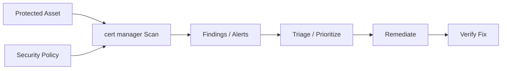

# cert-manager — A 2-Day Crash Course

cert-manager automates the TLS certificate lifecycle in Kubernetes — issue, renew, rotate, never expire again.

**Prerequisite:** Read `Kubernetes.md` first. You need to understand Deployments, Services, Ingress, Secrets, and CRDs before this makes sense.

---

## Part 0 — Why cert-manager Exists

Manual certificate management is a trap. You request a cert, drop it in a Secret, wire up your Ingress, and ship. Six months later at 2 a.m., your cert expired and your site is down. You scramble to renew it, update the Secret, restart the pod. The whole process takes an hour you don't have.

This happens because certificates are stateful, time-bound, and easy to forget. The renewal cadence doesn't match any other operational rhythm — not deployments, not releases, not on-call rotations. It falls through the cracks.

cert-manager solves this by treating certificates as Kubernetes objects. You declare what you want — a cert for `api.example.com` from Let's Encrypt — and cert-manager handles the rest: initial issuance, watching expiry, renewing at 2/3 of the cert's lifetime, and updating the Secret automatically. Your Ingress picks up the new cert without any intervention from you.

The operational contract shifts from "remember to renew" to "declare intent, observe state."

---

## Vocabulary

**Issuer** — A namespaced resource that defines how to obtain certificates. Scoped to a single namespace. Use when different teams manage their own cert issuance.

**ClusterIssuer** — Same as Issuer but cluster-scoped. One ClusterIssuer can serve all namespaces. The most common pattern for shared infrastructure.

**Certificate** — A Kubernetes CRD that declares a desired certificate. Specifies the DNS names, the Issuer or ClusterIssuer to use, and the Secret where the cert should land.

**CertificateRequest** — An intermediate resource cert-manager creates automatically when processing a Certificate. You rarely interact with it directly, but it's visible in `kubectl get certificaterequest`.

**ACME** — Automated Certificate Management Environment. A protocol (RFC 8555) for automated cert issuance. Let's Encrypt uses ACME. cert-manager speaks ACME natively.

**Let's Encrypt** — A free, public certificate authority that issues 90-day TLS certs via ACME. Widely trusted. Two environments: staging (for testing, not browser-trusted) and production.

**HTTP01** — An ACME challenge type. Let's Encrypt asks you to serve a specific token at `http://<domain>/.well-known/acme-challenge/<token>`. cert-manager spins up a temporary pod to answer it. Requires port 80 to be reachable from the internet.

**DNS01** — An ACME challenge type. Let's Encrypt asks you to create a TXT record at `_acme-challenge.<domain>`. cert-manager uses your DNS provider's API to set it. Required for wildcard certs. Works even if port 80 is blocked.

**CA** — Certificate Authority. An entity that signs certificates. Let's Encrypt is a public CA. You can also run your own internal CA with cert-manager.

**Private Key** — The secret half of a TLS key pair. cert-manager generates it, stores it in a Kubernetes Secret, and rotates it on renewal if configured.

**Secret** — A standard Kubernetes Secret where cert-manager stores the issued certificate and private key (`tls.crt` and `tls.key`). Your Ingress or pod references this Secret.

---




## DAY 1 — Get Running

### Install via Helm

cert-manager publishes an official Helm chart. Install it into its own namespace:

```bash
helm repo add jetstack https://charts.jetstack.io
helm repo update

helm install cert-manager jetstack/cert-manager \
  --namespace cert-manager \
  --create-namespace \
  --set crds.enabled=true
```

The `crds.enabled=true` flag installs the Custom Resource Definitions alongside the chart. Verify everything is running:

```bash
kubectl get pods -n cert-manager
```

You should see three pods: `cert-manager`, `cert-manager-cainjector`, and `cert-manager-webhook`. All three need to be `Running` before you proceed.

### Create a ClusterIssuer for Let's Encrypt

Start with the staging environment. Staging certs aren't trusted by browsers, but they let you validate your setup without hitting production rate limits — Let's Encrypt production enforces 5 duplicate certs per week per domain.

```yaml
apiVersion: cert-manager.io/v1
kind: ClusterIssuer
metadata:
  name: letsencrypt-staging
spec:
  acme:
    server: https://acme-staging-v02.api.letsencrypt.org/directory
    email: ops@example.com
    privateKeySecretRef:
      name: letsencrypt-staging-account-key
    solvers:
    - http01:
        ingress:
          class: nginx
```

Then create the production ClusterIssuer — identical except for the server URL:

```yaml
apiVersion: cert-manager.io/v1
kind: ClusterIssuer
metadata:
  name: letsencrypt-prod
spec:
  acme:
    server: https://acme-v02.api.letsencrypt.org/directory
    email: ops@example.com
    privateKeySecretRef:
      name: letsencrypt-prod-account-key
    solvers:
    - http01:
        ingress:
          class: nginx
```

Apply both:

```bash
kubectl apply -f clusterissuer-staging.yaml
kubectl apply -f clusterissuer-prod.yaml
```

Check status:

```bash
kubectl describe clusterissuer letsencrypt-prod
```

Look for `Status: True` and `Reason: ACMEAccountRegistered` in the conditions.

### Issue Your First Certificate

Create a Certificate resource:

```yaml
apiVersion: cert-manager.io/v1
kind: Certificate
metadata:
  name: api-example-com
  namespace: default
spec:
  secretName: api-example-com-tls
  issuerRef:
    name: letsencrypt-prod
    kind: ClusterIssuer
  dnsNames:
  - api.example.com
```

Apply it and watch:

```bash
kubectl apply -f certificate.yaml
kubectl describe certificate api-example-com -n default
```

cert-manager creates a CertificateRequest, triggers the ACME challenge, and — once validated — populates `api-example-com-tls` with `tls.crt` and `tls.key`.

Reference the Secret in your Ingress:

```yaml
spec:
  tls:
  - hosts:
    - api.example.com
    secretName: api-example-com-tls
```

### Ingress Annotation Shortcut

You don't always need to write a Certificate resource by hand. cert-manager watches Ingresses for an annotation and creates the Certificate automatically:

```yaml
apiVersion: networking.k8s.io/v1
kind: Ingress
metadata:
  name: api-ingress
  annotations:
    cert-manager.io/cluster-issuer: letsencrypt-prod
spec:
  tls:
  - hosts:
    - api.example.com
    secretName: api-example-com-tls
  rules:
  - host: api.example.com
    http:
      paths:
      - path: /
        pathType: Prefix
        backend:
          service:
            name: api-service
            port:
              number: 80
```

The annotation `cert-manager.io/cluster-issuer: letsencrypt-prod` tells cert-manager to take ownership. It creates and manages the Certificate object for you. This is the fastest path for standard HTTP services.

---

## DAY 2 — Advanced Patterns

### DNS01 Challenges and Wildcard Certs

HTTP01 challenges can't issue wildcard certs (`*.example.com`). For wildcards, you need DNS01. cert-manager supports most DNS providers through webhook solvers. Here's a configuration using Route53:

```yaml
apiVersion: cert-manager.io/v1
kind: ClusterIssuer
metadata:
  name: letsencrypt-prod-dns
spec:
  acme:
    server: https://acme-v02.api.letsencrypt.org/directory
    email: ops@example.com
    privateKeySecretRef:
      name: letsencrypt-prod-dns-account-key
    solvers:
    - dns01:
        route53:
          region: us-east-1
          accessKeyIDSecretRef:
            name: route53-credentials
            key: access-key-id
          secretAccessKeySecretRef:
            name: route53-credentials
            key: secret-access-key
```

Then request the wildcard:

```yaml
apiVersion: cert-manager.io/v1
kind: Certificate
metadata:
  name: wildcard-example-com
  namespace: default
spec:
  secretName: wildcard-example-com-tls
  issuerRef:
    name: letsencrypt-prod-dns
    kind: ClusterIssuer
  dnsNames:
  - "*.example.com"
  - example.com
```

cert-manager creates the `_acme-challenge.example.com` TXT record via the Route53 API, waits for propagation, and completes the challenge. DNS propagation can take 1–5 minutes — be patient.

### Private CA

For internal services that don't need public trust, run your own CA inside the cluster:

```yaml
apiVersion: v1
kind: Secret
metadata:
  name: internal-ca-key-pair
  namespace: cert-manager
type: kubernetes.io/tls
data:
  tls.crt: <base64-encoded-ca-cert>
  tls.key: <base64-encoded-ca-key>
---
apiVersion: cert-manager.io/v1
kind: ClusterIssuer
metadata:
  name: internal-ca
spec:
  ca:
    secretName: internal-ca-key-pair
```

Services issued by `internal-ca` are trusted within your cluster if you distribute the CA cert to trust stores. Use trust-manager for that distribution.

### Vault Integration

HashiCorp Vault is common in enterprises with existing PKI infrastructure. cert-manager has a Vault issuer:

```yaml
apiVersion: cert-manager.io/v1
kind: ClusterIssuer
metadata:
  name: vault-issuer
spec:
  vault:
    server: https://vault.example.com
    path: pki/sign/my-role
    auth:
      kubernetes:
        role: cert-manager
        mountPath: /v1/auth/kubernetes
        secretRef:
          name: vault-token
          key: token
```

Vault handles signing, rotation policy, and audit logging. cert-manager handles the Kubernetes lifecycle. The Vault PKI secrets engine must be configured with a role that permits the domains you're requesting.

### trust-manager

cert-manager issues certs and manages private keys. It does not distribute CA bundles. trust-manager — a companion project — handles CA trust distribution across namespaces.

Install it:

```bash
helm install trust-manager jetstack/trust-manager \
  --namespace cert-manager \
  --set app.trust.namespace=cert-manager
```

Create a Bundle to distribute your internal CA cert to all namespaces:

```yaml
apiVersion: trust.cert-manager.io/v1alpha1
kind: Bundle
metadata:
  name: internal-ca-bundle
spec:
  sources:
  - secret:
      name: internal-ca-key-pair
      key: tls.crt
  target:
    configMap:
      key: ca.crt
    namespaceSelector:
      matchLabels:
        kubernetes.io/metadata.name: ".*"
```

Every namespace gets a ConfigMap named `internal-ca-bundle` containing the CA cert. Mount it in pods that need to trust internally-issued certs.

### Monitoring Certificate Expiry

cert-manager exposes Prometheus metrics from the controller pod on port 9402. The metric you care about most:

```
certmanager_certificate_expiration_timestamp_seconds
```

Add an alert:

```yaml
- alert: CertificateExpiringSoon
  expr: |
    (certmanager_certificate_expiration_timestamp_seconds
     - time()) / 86400 < 14
  for: 1h
  labels:
    severity: warning
  annotations:
    summary: "Certificate {{ $labels.name }} expires in less than 14 days"
```

Also watch:

- `certmanager_certificate_ready_status` — 1 means ready, 0 means broken
- `certmanager_http_acme_client_request_count` — spikes indicate retry storms

### Troubleshooting Failed Issuance

When a cert doesn't appear, work down the resource chain:

```bash
# Start here
kubectl describe certificate <name> -n <namespace>

# Then look at the request
kubectl get certificaterequest -n <namespace>
kubectl describe certificaterequest <name> -n <namespace>

# Then look at the ACME order
kubectl get order -n <namespace>
kubectl describe order <name> -n <namespace>

# Then look at the challenge
kubectl get challenge -n <namespace>
kubectl describe challenge <name> -n <namespace>
```

Common failure modes and their fixes:

| Symptom | Cause | Fix |
|---------|-------|-----|
| Challenge stuck in `pending` | Port 80 unreachable | Open firewall, check LoadBalancer |
| `CAA record does not allow` | CAA DNS record restricts the CA | Add Let's Encrypt to your CAA record |
| `too many certificates` | Hit production rate limit | Use staging first, wait 1 week |
| `context deadline exceeded` | DNS propagation timeout on DNS01 | Increase solver timeout, check DNS API credentials |
| `no matches for kind "Certificate"` | CRDs not installed | Reinstall with `crds.enabled=true` |
| Cert issued but Ingress shows old cert | Ingress controller not reloading | Restart Ingress controller pod |

The cert-manager logs are your final fallback:

```bash
kubectl logs -n cert-manager deployment/cert-manager | grep ERROR
```

---

## Worked Example — Automatic TLS for All Ingresses

The goal: every Ingress in the cluster gets HTTPS automatically, no per-resource cert management.

**Step 1** — Install cert-manager with Helm (see Day 1).

**Step 2** — Create a production ClusterIssuer:

```yaml
apiVersion: cert-manager.io/v1
kind: ClusterIssuer
metadata:
  name: letsencrypt-prod
spec:
  acme:
    server: https://acme-v02.api.letsencrypt.org/directory
    email: ops@example.com
    privateKeySecretRef:
      name: letsencrypt-prod-account-key
    solvers:
    - http01:
        ingress:
          class: nginx
```

**Step 3** — Set the default ClusterIssuer in the cert-manager Helm values so every Ingress is auto-annotated:

```yaml
# values.yaml for cert-manager
ingressShim:
  defaultIssuerName: letsencrypt-prod
  defaultIssuerKind: ClusterIssuer
```

Upgrade the release:

```bash
helm upgrade cert-manager jetstack/cert-manager \
  --namespace cert-manager \
  -f values.yaml
```

**Step 4** — Deploy a service and Ingress. The Ingress only needs a `tls` block — no annotation required when using the default issuer shim:

```yaml
apiVersion: networking.k8s.io/v1
kind: Ingress
metadata:
  name: my-service
spec:
  tls:
  - hosts:
    - myservice.example.com
    secretName: myservice-tls
  rules:
  - host: myservice.example.com
    http:
      paths:
      - path: /
        pathType: Prefix
        backend:
          service:
            name: my-service
            port:
              number: 80
```

cert-manager sees the `tls` block, creates a Certificate, runs the HTTP01 challenge, and populates `myservice-tls`. Nginx picks it up. Done.

**Step 5** — Verify:

```bash
kubectl get certificate
# NAME            READY   SECRET          AGE
# myservice-tls   True    myservice-tls   2m

openssl s_client -connect myservice.example.com:443 \
  -servername myservice.example.com </dev/null 2>/dev/null \
  | openssl x509 -noout -dates
```

---

## Pitfalls

**Using production Let's Encrypt before staging works.** Rate limits are strict. If your setup is broken, you'll hit the 5-cert-per-week limit before you get a working cert. Always validate with staging first.

**Forgetting to open port 80 for HTTP01 challenges.** The challenge solver pod needs to be reachable on port 80 from Let's Encrypt's servers. If your LoadBalancer only routes 443, HTTP01 will never complete. Use DNS01 if you can't open port 80.

**Wildcard certs with HTTP01.** HTTP01 cannot prove control of `*.example.com`. If you request a wildcard, you must use DNS01. cert-manager will try and fail indefinitely if you mismatch these.

**One ClusterIssuer for everything.** A single ClusterIssuer works fine until different teams need different issuers — internal CA for backend services, Let's Encrypt for public-facing. Plan your issuer topology early.

**Not watching the certificate expiry metric.** cert-manager renews certs automatically, but renewal can fail — rate limits, DNS outages, expired ACME account keys. If you're not alerting on `certmanager_certificate_ready_status`, you won't know until users do.

**Deleting a Secret without deleting the Certificate.** cert-manager will detect the missing Secret and re-issue — but there's a window where the service has no cert. If you need to rotate, trigger rotation through the Certificate object, not by deleting the Secret.

**Not pinning the cert-manager version.** cert-manager follows Kubernetes version compatibility closely. A cluster upgrade may require a cert-manager upgrade. Pin the Helm chart version and upgrade deliberately.

---

## Quick Reference

```bash
# Check all certificates
kubectl get certificate -A

# Describe a failing cert
kubectl describe certificate <name> -n <namespace>

# Force immediate renewal
kubectl annotate certificate <name> -n <namespace> \
  cert-manager.io/issue-once="$(date)"

# View cert expiry from the Secret
kubectl get secret <tls-secret> -n <namespace> \
  -o jsonpath='{.data.tls\.crt}' \
  | base64 -d | openssl x509 -noout -enddate

# Check ACME challenges
kubectl get challenge -A

# View cert-manager logs
kubectl logs -n cert-manager deployment/cert-manager --tail=100

# List ClusterIssuers
kubectl get clusterissuer

# Describe ClusterIssuer status
kubectl describe clusterissuer letsencrypt-prod
```

---


## Top 10 Interview Questions

<details>
<summary><strong>Q: What is cert manager and what problem does it solve?</strong></summary>

cert manager addresses a specific need in modern engineering workflows. Understanding the core problem it solves — and the alternatives it replaced — is the foundation for every subsequent interview question. Frame your answer around the pain point first, then the solution.

</details>

<details>
<summary><strong>Q: How does cert manager compare to its main alternatives?</strong></summary>

Every tool exists in an ecosystem of alternatives. Be prepared to articulate the specific tradeoffs: when cert manager is the right choice, when an alternative is better, and what factors drive the decision (scale, team expertise, existing infrastructure, compliance requirements).

</details>

<details>
<summary><strong>Q: What are the most common production pitfalls with cert manager?</strong></summary>

Production experience is what separates senior from junior engineers. Common pitfalls include: misconfiguration that works in dev but fails at scale, security oversights, inadequate monitoring, and operational procedures that are untested until an incident occurs. Cite specific examples from your experience.

</details>

<details>
<summary><strong>Q: How do you monitor and observe cert manager in production?</strong></summary>

Key metrics to track, alerting thresholds to set, dashboards to build, and log patterns to watch. Production monitoring should cover: health/liveness, performance (latency, throughput), capacity (resource utilisation), and business impact (error rates affecting users). Explain which metrics are leading indicators versus lagging.

</details>

<details>
<summary><strong>Q: How do you scale cert manager as load increases?</strong></summary>

Scaling strategies depend on the bottleneck: horizontal scaling (add more instances), vertical scaling (bigger instances), caching (reduce load), sharding (distribute data), and async processing (decouple components). Explain which approach applies to cert manager and at what scale each strategy becomes necessary.

</details>

<details>
<summary><strong>Q: How do you handle security and access control with cert manager?</strong></summary>

Security is non-negotiable in production. Cover: authentication and authorization mechanisms, secrets management (never in code), encryption (at rest and in transit), network security (firewalls, private networks), audit logging, and compliance requirements relevant to your industry.

</details>

<details>
<summary><strong>Q: How do you implement disaster recovery for cert manager?</strong></summary>

DR planning requires defining RTO (recovery time objective) and RPO (recovery point objective), implementing backup strategies, testing restore procedures, and documenting runbooks. Explain your backup strategy, how you test restores, and what your recovery procedure looks like.

</details>

<details>
<summary><strong>Q: How do you automate cert manager deployment and configuration management?</strong></summary>

Infrastructure as code, CI/CD pipelines, configuration management, and GitOps workflows. Explain how you version, test, deploy, and roll back changes. Cover: what is automated, what requires manual approval, and how you handle configuration drift.

</details>

<details>
<summary><strong>Q: How do you troubleshoot issues with cert manager in production?</strong></summary>

A systematic debugging approach: check health endpoints, review recent changes (deploys, config changes), examine logs and metrics, reproduce the issue, identify root cause, fix, verify, and write a postmortem. Explain your actual debugging workflow with concrete examples.

</details>

<details>
<summary><strong>Q: What are the best practices for cert manager that you have learned from experience?</strong></summary>

Best practices that go beyond documentation: lessons learned from production incidents, configuration patterns that prevent common issues, testing strategies that catch bugs before production, and operational procedures that reduce toil. Share specific examples where following (or not following) a best practice had measurable impact.

</details>

---

## Next Steps

- `Kubernetes.md` — Ingress controllers, Secrets, CRDs, RBAC
- `Vault.md` — PKI secrets engine, Kubernetes auth, cert signing roles
- `Nginx.md` — How Nginx reloads TLS certs, proxy configuration
- `Helm.md` — Managing cert-manager upgrades, chart values

---

## Recommended learning resources

**YouTube channels & playlists:**
- [CNCF — cert-manager talks (KubeCon)](https://www.youtube.com/@cncf) — maintainer-led sessions on architecture, ACME challenges, and trust management
- [TechWorld with Nana — Kubernetes TLS](https://www.youtube.com/@TechWorldwithNana) — practical walkthroughs of cert-manager with Ingress controllers and Let's Encrypt
- [John Hammond — TLS and Certificate Security](https://www.youtube.com/@_JohnHammond) — understanding certificate chains, trust anchors, and what can go wrong
- [That DevOps Guy — cert-manager Tutorial](https://www.youtube.com/@yourdevopsguy) — step-by-step setup of cert-manager with DNS01 and HTTP01 solvers
- [Computerphile — How TLS Works](https://www.youtube.com/@Computerphile) — foundational cryptography concepts that explain why certificate automation matters

**Official docs & blogs:**
- [cert-manager Official Documentation](https://cert-manager.io/docs/) — installation, issuer configuration, ACME setup, and troubleshooting reference
- [Let's Encrypt Documentation](https://letsencrypt.org/docs/) — understanding the ACME protocol, rate limits, and certificate lifecycle that cert-manager automates
- [Jetstack Blog](https://www.jetstack.io/blog/) — advanced cert-manager patterns, trust distribution, and enterprise PKI with Kubernetes

---

## The Mantra

Declare the certificate. Trust the controller. Observe the state. Never touch a cert by hand again.
