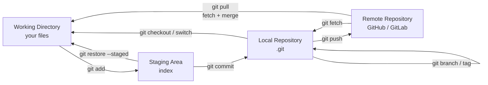

# Git — A 2-Day Crash Course

> **In one sentence:** Git is a version control system that records snapshots of your project over
> time, lets many people work on the same code without overwriting each other, and lets you branch
> off to try things and merge them back — it's the foundation of all modern software collaboration.

---

## Part 0 — The mental model that makes Git click

Most people learn Git as a list of magic commands and stay confused for years. The shortcut is to
understand its **mental model** first.

Git tracks your project as a series of **snapshots** (called *commits*), not as diffs. Each commit
is a complete picture of your files at one moment, plus a pointer to the commit before it. So your
history is a *chain of snapshots*. A **branch** is just a movable label pointing at one commit —
making a branch is cheap (it's a pointer, not a copy). This is why Git encourages branching freely.

**The three areas — internalize this and Git stops being mysterious:**
```
Working Directory  ──git add──►  Staging Area  ──git commit──►  Repository (.git)
(your actual files)              (what you've                   (permanent snapshots/history)
                                  marked to save next)
```
- **Working directory** — the files you're editing right now.
- **Staging area (index)** — a "loading dock" where you place exactly the changes you want in the
  next commit. This lets you commit *some* changes and not others.
- **Repository** — the committed history, stored in the hidden `.git` folder.

So the core loop is: edit files (working dir) → `git add` the ones you want (staging) →
`git commit` to save a snapshot (repository). Most Git confusion is forgetting which of these three
areas a file is in. `git status` tells you, always.

**Distributed:** every clone is a *full* copy of the entire history. You commit locally (offline,
instant), then `push`/`pull` to sync with a shared remote (GitHub/GitLab). Local and remote are
separate; you control when they sync.



---

## Part 1 — The vocabulary

| Term | Meaning |
|------|---------|
| **Repository (repo)** | A project tracked by Git (the `.git` folder holds everything) |
| **Commit** | A saved snapshot + message + author + parent pointer |
| **Branch** | A movable pointer to a commit; an independent line of work |
| **HEAD** | A pointer to "where you are now" (usually the tip of your current branch) |
| **Remote** | A shared copy elsewhere (e.g. `origin` on GitHub) |
| **Clone / Push / Pull** | Copy a repo / send commits up / fetch+merge commits down |
| **Merge / Rebase** | Two ways to combine branches |
| **Staging area (index)** | What you've marked to include in the next commit |

---

## DAY 1 — The everyday loop

### 1. One-time setup
```bash
git config --global user.name  "Gurpreet Singh"
git config --global user.email "you@example.com"
git config --global init.defaultBranch main
git config --global pull.rebase false       # or true if your team prefers rebase-on-pull
```

### 2. Start or get a repo
```bash
git init                       # turn the current folder into a repo
# or
git clone https://github.com/org/repo.git   # copy an existing repo (history included)
```

### 3. The core loop — status, add, commit
```bash
git status                     # YOUR COMPASS — what's changed, staged, untracked. Run it constantly.
git add file.txt               # stage one file
git add .                      # stage everything changed
git add -p                     # stage interactively, chunk by chunk (great for clean commits)
git commit -m "Add login validation"   # snapshot the staged changes
git commit -am "msg"           # add (tracked files) + commit in one step
```
`git status` is your single most important command — it tells you exactly which of the three areas
each file is in and what to do next. When confused, run `git status`.

### 4. See what happened
```bash
git log --oneline --graph --all     # compact, visual history — make this an alias
git log -p file.txt                 # history of one file with diffs
git diff                            # unstaged changes (working dir vs staging)
git diff --staged                   # staged changes (staging vs last commit)
git show <commit>                   # what a specific commit changed
```
`git diff` (not yet staged) vs `git diff --staged` (staged, about to be committed) — knowing the
difference clarifies the three-areas model.

### 5. Branching — the heart of Git workflow
```bash
git branch                          # list branches (* = current)
git switch -c feature/login         # create AND switch to a new branch (modern)
git switch main                     # switch back (modern; older: git checkout)
git branch -d feature/login         # delete a merged branch
```
Branches are cheap pointers — make one for every feature/fix. You work on `feature/x`, then merge
it into `main` when done. This keeps `main` stable while you experiment.

### 6. Syncing with the remote
```bash
git remote -v                       # show remotes (origin = the shared repo)
git push -u origin feature/login    # push your branch up (-u sets tracking, once)
git push                            # subsequent pushes
git pull                            # fetch remote changes AND merge into your branch
git fetch                           # download remote changes WITHOUT merging (safer; inspect first)
```
`fetch` then look, vs `pull` (fetch+merge in one) — `fetch` is the cautious choice when you want to
see what's incoming before integrating.

**By end of Day 1 you can:** init/clone, run the add→commit loop, read history and diffs, branch
and switch, and push/pull. That's the daily 90% of Git.

---

## DAY 2 — Collaboration, merges, and fixing mistakes

### 1. The standard team workflow (feature branch + pull request)
```text
1. git switch -c feature/checkout main      # branch off the latest main
2. ...edit, git add, git commit...          # small, focused commits
3. git push -u origin feature/checkout       # push the branch
4. Open a Pull Request (PR) / Merge Request on GitHub/GitLab
5. Teammates review; CI runs (see GitHub-Actions.md / GitLab-CI.md)
6. Merge the PR into main; delete the branch
7. git switch main && git pull               # get the merged result locally
```
You almost never commit directly to `main` on a team — you branch, push, and merge via reviewed
PRs. This is also what GitOps (Argo CD) relies on: the merge to main *is* the deploy trigger.

### 2. Merging vs rebasing (the classic confusion)
Both combine branches; they differ in *how the history looks*:
```bash
# MERGE: creates a merge commit; preserves the true, branching history
git switch main
git merge feature/checkout

# REBASE: replays your commits on top of the latest main; linear, clean history
git switch feature/checkout
git rebase main
```
- **Merge** keeps the real shape (good for shared/public branches; never lose information).
- **Rebase** rewrites your commits onto a new base for a tidy straight line (good for *your own*
  feature branch before merging).
- **The golden rule: never rebase commits that others have already pulled** (shared/public
  history). Rebasing rewrites commit IDs and will wreck their copies. Rebase only your local,
  un-pushed work.

### 3. Merge conflicts (they're normal — don't panic)
When two branches changed the same lines, Git can't auto-merge and marks the conflict:
```
<<<<<<< HEAD
your version
=======
their version
>>>>>>> feature/checkout
```
```bash
# 1. git status shows conflicted files
# 2. open each, pick/combine the right content, delete the <<<< ==== >>>> markers
# 3. git add <resolved-file>
# 4. git commit          (or: git rebase --continue if mid-rebase)
git merge --abort        # bail out and start over if it's a mess
```
Resolving a conflict is just: decide what the final code should be, remove the markers, `add`,
and finish. A merge tool or your IDE makes this visual.

### 4. Undoing things (the safety net — know these before you need them)
```bash
git restore file.txt              # discard unstaged changes to a file (working dir)
git restore --staged file.txt     # unstage (keep the edit, remove from staging)
git commit --amend                # fix the LAST commit (message or add forgotten files)

git revert <commit>               # make a NEW commit that undoes a commit — SAFE for shared history
git reset --soft  HEAD~1          # undo last commit, KEEP changes staged
git reset --mixed HEAD~1          # undo last commit, keep changes unstaged (default)
git reset --hard  HEAD~1          # undo last commit AND discard changes — DESTRUCTIVE
```
**`revert` vs `reset`:** `revert` adds a new "undo" commit and is safe to use on `main`/shared
branches. `reset` rewrites history (moves the branch pointer back) — only use it on local,
un-pushed commits. `--hard` throws away work; be sure.

### 5. The reflog — your time machine (almost nothing is truly lost)
```bash
git reflog                        # a log of everywhere HEAD has been (commits, resets, rebases)
git reset --hard HEAD@{2}         # jump back to a previous state from the reflog
```
Did a `reset --hard` and panicked? The old commit is still in the reflog for ~90 days. The reflog
has saved countless engineers — it records every move, even "lost" ones.

### 6. Stashing (park work without committing)
```bash
git stash                         # shelve uncommitted changes, get a clean working dir
git stash list
git stash pop                     # bring the most recent stash back
git stash apply stash@{1}         # apply a specific one (keep it in the list)
```
Use when you need to quickly switch branches but aren't ready to commit.

### 7. `.gitignore` — keep junk and secrets out
```gitignore
node_modules/
*.log
.env                 # NEVER commit secrets/credentials
*.tfstate            # never commit Terraform state (see Terraform.md)
__pycache__/
.DS_Store
```
> Crucial: never commit secrets (API keys, `.env`, tokens). If you do, the secret is in history
> forever even after deletion — you must rotate it *and* purge history (`git filter-repo`). Add
> sensitive paths to `.gitignore` *before* the first commit. (Relevant to your plaintext-secrets
> habit — `.gitignore` the config and secret files.)

---

## Worked example — feature branch through to merge, with a fix
```text
1. git switch -c feature/retry main
2. edit; git add -p; git commit -m "Add retry with backoff"
3. Realize you missed a file: git add missed.py; git commit --amend --no-edit
4. main moved on: git fetch origin; git rebase origin/main   # replay your work on latest main
5. Conflict in client.py -> edit, remove markers, git add client.py, git rebase --continue
6. git push -u origin feature/retry   (force-with-lease if you rebased after pushing:
      git push --force-with-lease)
7. Open PR -> review -> CI green -> merge -> delete branch
8. git switch main && git pull
```

---

## Common pitfalls
- **Not running `git status`.** It answers "what state am I in?" 90% of confusion dissolves once
  you check status (and `git log --oneline --graph`).
- **Committing secrets.** They persist in history forever. `.gitignore` them up front; if leaked,
  rotate the secret and purge history.
- **Rebasing shared history.** Rewrites commit IDs and breaks everyone who pulled. Rebase only
  your local, un-pushed branch. Use `--force-with-lease` (not `--force`) if you must force-push.
- **`reset --hard` carelessly.** It discards work. Prefer `revert` on shared branches; remember
  the reflog can rescue you.
- **Giant, mixed commits.** "Fixed stuff" touching 40 files is unreviewable. Make small, focused
  commits with clear messages (`git add -p` helps).
- **Confusing fetch and pull.** `pull` = fetch + merge (changes your branch now). `fetch` =
  download only (inspect first). Use fetch when cautious.
- **Working directly on `main`.** Branch for every change; merge via reviewed PRs.
- **Detached HEAD panic.** `git switch -c newbranch` to save work, or `git switch main` to get
  back — it's not broken, HEAD just isn't on a branch.

---

## Quick command reference
```bash
# Setup / start
git config --global user.name|user.email "..."
git init      git clone URL

# Daily loop
git status                 git add [file|.|-p]      git restore [--staged] file
git commit -m "msg"        git commit -am "msg"     git commit --amend
git diff [--staged]        git log --oneline --graph --all     git show COMMIT

# Branches
git branch [-d name]       git switch [-c] name     git switch -
git merge BRANCH           git rebase BRANCH        git cherry-pick COMMIT
git tag v1.0               git tag -a v1.0 -m "msg"

# Remotes
git remote -v              git remote add origin URL
git push [-u origin BR]    git push --force-with-lease
git fetch [origin]         git pull

# Undo / recover
git revert COMMIT          git reset --soft|--mixed|--hard HEAD~1
git reflog                 git reset --hard HEAD@{n}
git stash [push|list|pop|apply|drop]
git restore [--source=COMMIT] file

# Inspect / debug
git blame file             git bisect start|good|bad     git log --grep="text"
git log -- file            git diff BR1..BR2             git clean -fd  (remove untracked)
```

---

## Top 10 Interview Questions

<details>
<summary><strong>Q: What is the difference between merge and rebase, and when would you use each?</strong></summary>

Merge creates a merge commit that combines two branches, preserving the true branching history. Rebase replays your commits on top of the target branch, producing a clean linear history. Use merge for shared/public branches where preserving the real timeline matters. Use rebase on your own local feature branch before merging to keep the history tidy. The golden rule: never rebase commits that others have already pulled.

</details>

<details>
<summary><strong>Q: Explain the three areas in Git (working directory, staging area, repository) and how data moves between them.</strong></summary>

The working directory holds your actual files on disk. The staging area (index) is a "loading dock" where you place changes you intend to include in the next commit via `git add`. The repository (`.git`) stores the permanent history of committed snapshots. The flow is: edit files (working dir) -> `git add` (staging) -> `git commit` (repository). `git status` always tells you which area each change is in.

</details>

<details>
<summary><strong>Q: What is `git reflog` and how can it save you from a bad `reset --hard`?</strong></summary>

The reflog is a local log of every position HEAD has been in — every commit, reset, rebase, checkout, and amend. Even after a `reset --hard` that apparently "deleted" commits, those commits still exist in the object store for about 90 days. You can run `git reflog`, find the SHA of the state before the reset, and `git reset --hard HEAD@{n}` to recover. It is Git's safety net for almost any destructive local operation.

</details>

<details>
<summary><strong>Q: How does `git bisect` work, and when would you use it?</strong></summary>

`git bisect` performs a binary search through your commit history to find the exact commit that introduced a bug. You start with `git bisect start`, mark a known bad commit and a known good commit, and Git checks out the midpoint for you to test. After each test you mark it `good` or `bad`, halving the search space until the offending commit is identified. It turns a linear search of hundreds of commits into about seven checks.

</details>

<details>
<summary><strong>Q: What is the difference between `git fetch` and `git pull`?</strong></summary>

`git fetch` downloads new commits and refs from the remote but does not modify your working branch — it updates your remote-tracking branches (e.g. `origin/main`) only. `git pull` is `fetch` plus an automatic merge (or rebase, depending on config) into your current branch. Fetch is the safer option when you want to inspect incoming changes before integrating them; pull is the convenience shortcut when you trust the merge will be clean.

</details>

<details>
<summary><strong>Q: How do you resolve a merge conflict?</strong></summary>

When Git cannot auto-merge because both branches modified the same lines, it marks the conflicted sections with `<<<<<<<`, `=======`, and `>>>>>>>` markers. You open each conflicted file, decide what the final code should be (keeping one side, the other, or a combination), remove the conflict markers, then `git add` the resolved file and complete the merge or rebase. Using a merge tool or IDE makes this visual. `git merge --abort` lets you bail out and start over if needed.

</details>

<details>
<summary><strong>Q: What is `git cherry-pick` and what are its risks?</strong></summary>

`cherry-pick` applies the changes from a specific commit onto your current branch as a new commit. It is useful for backporting a bug fix from a development branch to a release branch without merging everything else. The risk is that it creates a duplicate commit with a different SHA, so if the original branch is later merged, you may see the same change appear twice or cause conflicts. Use it sparingly and for targeted fixes.

</details>

<details>
<summary><strong>Q: What is the difference between `git reset` and `git revert`, and when is each appropriate?</strong></summary>

`reset` moves the branch pointer backward, effectively rewriting history — the "undone" commits disappear from the branch. `revert` creates a new commit that undoes the changes of a previous commit, preserving the full history. Use `revert` on shared/public branches (main, release) because it is safe for collaborators. Use `reset` only on local, un-pushed work where rewriting history won't affect anyone else.

</details>

<details>
<summary><strong>Q: You accidentally committed a secret (API key) to the repository. What do you do?</strong></summary>

First, rotate the secret immediately — it is compromised the moment it enters Git history, even if you delete the file in a subsequent commit. Then purge it from history using `git filter-repo` (preferred) or BFG Repo-Cleaner, force-push the cleaned history, and have all collaborators re-clone. Going forward, add sensitive paths to `.gitignore` before the first commit and use environment variables or a secrets manager instead of checked-in credentials.

</details>

<details>
<summary><strong>Q: Explain `--force-with-lease` and why it is preferred over `--force` when force-pushing.</strong></summary>

`--force` overwrites the remote branch unconditionally — if a teammate pushed commits since your last fetch, those commits are silently lost. `--force-with-lease` checks that the remote branch is at the ref you expect (your last known state); if someone else has pushed in the meantime, the push is rejected, protecting their work. It is the safe alternative whenever you must force-push after a rebase, and should be the only force-push you ever use on shared branches.

</details>

---

## Next steps after Day 2
- Pick a branching model (trunk-based with short-lived branches, or Git Flow) and stick to it.
- Write good commit messages (imperative subject ≤50 chars, body explains *why*) — consider
  **Conventional Commits** for automated changelogs.
- `git bisect` to find the commit that introduced a bug; `git worktree` for multiple branches at
  once; `git filter-repo` to purge secrets from history.
- Connect Git to CI/CD (PRs trigger pipelines — see `GitHub-Actions.md`) and GitOps (merges drive
  deploys — see `ArgoCD.md`).

## Recommended learning resources

**YouTube channels & playlists:**
- [The Coding Train — Git and GitHub for Beginners](https://www.youtube.com/@TheCodingTrain) — Daniel Shiffman's visual, friendly explanations of Git fundamentals
- [Fireship — Git explained in 100 Seconds](https://www.youtube.com/@Fireship) — quick conceptual overview of Git internals and daily commands
- [TechWorld with Nana — Git Tutorial for Beginners](https://www.youtube.com/@TechWorldwithNana) — practical walkthrough of branching, merging, and collaboration
- [GitHub Official — Git and GitHub tutorials](https://www.youtube.com/@GitHub) — official guides on pull requests, code review, and GitHub Flow
- [DevOps Toolkit — Git workflows](https://www.youtube.com/@DevOpsToolkit) — trunk-based development, Git Flow, and branching strategy comparisons

**Official docs & blogs:**
- [Pro Git Book (free online)](https://git-scm.com/book/en/v2) — the definitive Git reference, covers internals and advanced workflows
- [Git Official Documentation](https://git-scm.com/doc)

---

**The mantra:** edit → add → commit, three areas (working/staging/repo). Branch for everything,
merge via reviewed PRs, never rebase shared history, never commit secrets, and run `git status`
whenever you're unsure. The reflog means almost nothing is ever truly lost.
