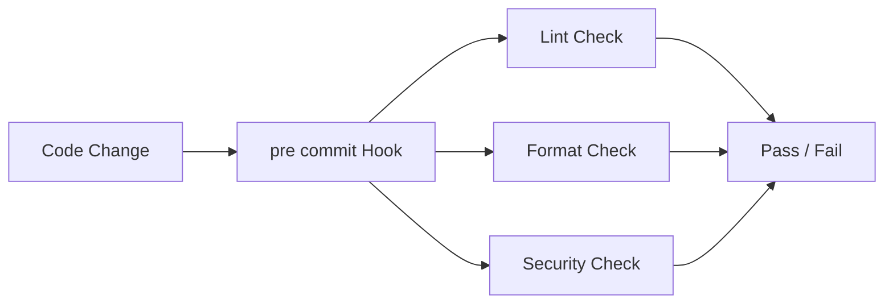

# pre-commit — A 2-Day Crash Course

pre-commit is a framework for managing git pre-commit hooks — run linters, formatters, secret scanners, and validators automatically before every commit.

---

## Part 0 — Why

Code review shouldn't catch formatting issues. When a reviewer has to write "trailing whitespace on line 47" or "this file needs Black formatting," you've wasted two people's time on something a machine should have caught three steps earlier.

pre-commit automates the boring checks. Before every commit, it runs whatever tools you configure — formatters, linters, secret scanners, YAML validators — and blocks the commit if anything fails. The feedback loop shrinks from hours (PR review) to seconds (local hook).

The practical wins:

- PRs contain only intentional changes, not noise from inconsistent formatting.
- New contributors get guardrails on day one without reading a style guide.
- CI catches fewer "oops" commits because local hooks already filtered them.
- Secrets don't reach the remote because a scanner runs before `git push` even fires.

pre-commit is not a replacement for CI. It's a first line of defense that runs where iteration is cheapest — your local machine.

---

## Vocabulary

**Hook** — A script git calls at a specific point in its workflow (pre-commit, pre-push, commit-msg, etc.). pre-commit manages these scripts for you so you don't write shell glue by hand.

**Repo (hook source)** — A git repository that contains one or more hook definitions. pre-commit clones these repos and caches them. You reference them by URL in your config. Examples: `https://github.com/pre-commit/pre-commit-hooks`, `https://github.com/psf/black`.

**Stage** — When a hook runs. The most common are `commit` (before the commit is recorded), `push` (before `git push` sends data), and `commit-msg` (after you type your message but before the commit is finalized).

**.pre-commit-config.yaml** — The single config file at the root of your repo that defines which hook repos to use and which hooks to activate. This file is committed to version control so every team member runs the same checks.

**Language** — The runtime pre-commit uses to install and execute a hook. Common values: `python`, `node`, `golang`, `system`, `script`. pre-commit installs isolated environments per hook so there's no conflict with your project's own dependencies.

**Types** — File type filters. A hook can declare `types: [python]` to run only on `.py` files, or `types: [yaml]` to run only on YAML. This prevents unnecessary work and false positives.

**Exclude / Include** — Regex patterns that narrow which files a hook processes. `exclude: ^vendor/` skips everything in the vendor directory. `files: \.py$` is equivalent to using the `types` filter but uses a raw pattern.

**autoupdate** — A built-in command (`pre-commit autoupdate`) that bumps every hook repo in your config to its latest tagged release. Run this periodically to stay current.

---




## DAY 1 — Install, Configure, Run

### Install pre-commit

```bash
pip install pre-commit
# or with pipx (keeps it isolated from project deps)
pipx install pre-commit
# verify
pre-commit --version
```

On macOS with Homebrew:

```bash
brew install pre-commit
```

### Create .pre-commit-config.yaml

Place this file at the root of your repo:

```yaml
repos:
  - repo: https://github.com/pre-commit/pre-commit-hooks
    rev: v4.6.0
    hooks:
      - id: trailing-whitespace
      - id: end-of-file-fixer
      - id: check-yaml
      - id: check-merge-conflict
      - id: check-added-large-files
        args: [--maxkb=500]

  - repo: https://github.com/adrienverge/yamllint
    rev: v1.35.1
    hooks:
      - id: yamllint
        args: [--strict]

  - repo: https://github.com/Yelp/detect-secrets
    rev: v1.5.0
    hooks:
      - id: detect-secrets
        args: [--baseline, .secrets.baseline]

  - repo: https://github.com/psf/black
    rev: 24.4.2
    hooks:
      - id: black
        language_version: python3.12

  - repo: https://github.com/pre-commit/mirrors-eslint
    rev: v9.4.0
    hooks:
      - id: eslint
        files: \.(js|ts|jsx|tsx)$
        additional_dependencies:
          - eslint@9.4.0
          - "@eslint/js@9.4.0"
```

Walk through what each section does:

- `repo` — where pre-commit fetches the hook definitions.
- `rev` — the exact git tag or SHA to pin. Always pin. Floating `main` means your hooks change without you noticing.
- `hooks` — a list of hook IDs from that repo. Each repo's README lists available IDs.
- `args` — extra arguments forwarded to the tool.
- `additional_dependencies` — npm packages pre-commit installs into the hook's isolated node environment. Necessary when the hook itself doesn't bundle its peer dependencies.

### Initialize detect-secrets baseline

detect-secrets compares against a baseline file so it doesn't flag secrets you've already audited and accepted:

```bash
detect-secrets scan > .secrets.baseline
git add .secrets.baseline
```

### Install the git hook scripts

```bash
pre-commit install
```

This writes a script to `.git/hooks/pre-commit`. From now on, every `git commit` triggers your hooks automatically. The `.git/` directory is not committed, so every developer needs to run `pre-commit install` once after cloning.

Add this to your project's setup instructions or Makefile:

```makefile
setup:
	pip install pre-commit
	pre-commit install
```

### Run hooks manually

You don't have to commit to test hooks. Run them against all files:

```bash
pre-commit run --all-files
```

Run a single hook:

```bash
pre-commit run black --all-files
pre-commit run trailing-whitespace --all-files
```

Run against staged files only (mirrors what happens on commit):

```bash
pre-commit run
```

### How a hook failure looks

```
trailing whitespace.................................................Failed
- hook id: trailing-whitespace
- exit code: 1
- files were modified by this formatter

fixing src/app.py
```

pre-commit tells you which hook failed, whether it modified files (formatters do this), and exits non-zero so the commit is blocked. After a formatter modifies files, you stage the changes and commit again:

```bash
git add src/app.py
git commit -m "fix: add user validation"
```

### Update hook versions

```bash
pre-commit autoupdate
```

This rewrites `rev` values in your config to the latest tags. Review the diff, test, then commit the updated config.

---

## DAY 2 — Custom Hooks, CI, Push Hooks, Commit Messages

### Local hooks

You can define hooks that live inside your own repo rather than a remote hook source. Use `repo: local`:

```yaml
repos:
  - repo: local
    hooks:
      - id: run-tests
        name: Run unit tests
        entry: pytest tests/ -x -q
        language: system
        pass_filenames: false
        stages: [pre-push]

      - id: check-migrations
        name: Check for missing migrations
        entry: python manage.py migrate --check
        language: system
        pass_filenames: false
```

`pass_filenames: false` tells pre-commit not to append changed filenames as arguments. Necessary for commands that don't accept file lists.

`language: system` means pre-commit uses whatever is available in the current shell environment instead of creating an isolated virtualenv.

### CI integration

Run pre-commit in CI against all files so nothing slips through if a developer skips local install:

```yaml
# GitHub Actions example
- name: Run pre-commit
  uses: pre-commit/action@v3.0.1

# or manually
- name: Run pre-commit
  run: |
    pip install pre-commit
    pre-commit run --all-files
```

Set `PRE_COMMIT_HOME` to a cached path (key off `.pre-commit-config.yaml`) to avoid re-downloading hook repos on every CI run.

### pre-push hooks

Some checks are too slow for every commit — full test suites, security scans, integration tests. Run these on push instead:

```bash
pre-commit install --hook-type pre-push
```

In your config, mark those hooks with `stages: [pre-push]`:

```yaml
- repo: local
  hooks:
    - id: full-test-suite
      name: Full test suite
      entry: pytest
      language: system
      pass_filenames: false
      stages: [pre-push]
```

Hooks without a `stages` key default to `[pre-commit]`.

### commit-msg hooks — conventional commits

Enforce commit message format before the commit is recorded:

```bash
pre-commit install --hook-type commit-msg
```

```yaml
repos:
  - repo: https://github.com/compilerla/conventional-pre-commit
    rev: v3.4.0
    hooks:
      - id: conventional-pre-commit
        stages: [commit-msg]
        args: [feat, fix, refactor, docs, test, chore, perf, ci, build]
```

Now a commit message like "fixed stuff" is rejected. You must write something like `fix: correct null check in user lookup`.

### Writing your own hook repo

If you have a check you want to share across multiple repos, publish it as a standalone git repo with a `.pre-commit-hooks.yaml` at the root declaring hook IDs, entry points, language, and file types. Pre-commit clones and caches it the same way it handles any other hook source. Reference it in consuming repos with `repo: https://github.com/yourorg/my-hooks` and pin a `rev`. The hook's `entry` field points to any executable — a Python script, a shell script, a compiled binary.

### Performance — skipping unchanged files

pre-commit is smart about this by default. It only passes changed files to each hook, so a repo with 10,000 files doesn't run Black on all of them for a one-line change.

For hooks where this behavior doesn't apply (e.g., `pass_filenames: false`), consider whether you really need them on every commit vs. on push.

Skip a hook for one commit when you know it would fail for a legitimate reason:

```bash
SKIP=eslint git commit -m "chore: add generated file"
```

⚠️ Don't make SKIP a habit. If you're skipping the same hook repeatedly, either fix the underlying issue or reconsider whether that hook belongs in your config.

Skip all hooks entirely (use sparingly):

```bash
git commit --no-verify -m "wip: scratch work"
```

`--no-verify` bypasses the entire hook chain. Reserve it for genuine emergencies — broken CI environments, merge conflict resolution — not for avoiding a linting complaint.

### pre-commit vs husky / lint-staged

All three tools run checks before commits. The differences matter depending on your stack.

**pre-commit** manages its own isolated environments per hook. It works across Python, Node, Go, and shell scripts regardless of what your project uses. Hook repos are pinned and versioned explicitly. It's language-agnostic by design.

**husky** is a Node package that installs git hooks. It's straightforward in pure Node projects but requires Node in the environment. Hook scripts are plain shell, so you wire up the tools yourself.

**lint-staged** runs tools only on staged files, optimizing for speed in large codebases. It's typically paired with husky rather than used standalone.

The practical answer: use pre-commit for polyglot repos (Python + Terraform + shell + YAML is common in platform engineering). Use husky + lint-staged for pure Node/frontend projects where the team is already deep in the npm ecosystem.

---

## Worked Example — Python + Terraform Project

```yaml
repos:
  # General file hygiene
  - repo: https://github.com/pre-commit/pre-commit-hooks
    rev: v4.6.0
    hooks:
      - id: trailing-whitespace
      - id: end-of-file-fixer
      - id: check-yaml
      - id: check-json
      - id: check-toml
      - id: check-merge-conflict
      - id: check-added-large-files
        args: [--maxkb=500]

  # Secret scanning
  - repo: https://github.com/Yelp/detect-secrets
    rev: v1.5.0
    hooks:
      - id: detect-secrets
        args: [--baseline, .secrets.baseline]
        exclude: package-lock\.json

  # Python formatting
  - repo: https://github.com/psf/black
    rev: 24.4.2
    hooks:
      - id: black
        language_version: python3.12

  # Python linting
  - repo: https://github.com/astral-sh/ruff-pre-commit
    rev: v0.4.7
    hooks:
      - id: ruff
        args: [--fix]

  # Python type checking (slow — run on push)
  - repo: local
    hooks:
      - id: mypy
        name: mypy type check
        entry: mypy src/
        language: system
        pass_filenames: false
        stages: [pre-push]

  # Terraform formatting
  - repo: https://github.com/antonbabenko/pre-commit-terraform
    rev: v1.92.0
    hooks:
      - id: terraform_fmt
      - id: terraform_validate
      - id: terraform_tflint
        args:
          - --args=--config=__GIT_WORKING_DIR__/.tflint.hcl

  # Conventional commits
  - repo: https://github.com/compilerla/conventional-pre-commit
    rev: v3.4.0
    hooks:
      - id: conventional-pre-commit
        stages: [commit-msg]
        args: [feat, fix, refactor, docs, test, chore, perf, ci, build]
```

Install all hook types at once:

```bash
pre-commit install
pre-commit install --hook-type commit-msg
pre-commit install --hook-type pre-push
```

---

## Pitfalls

**Not pinning `rev` to a tag.** Using `rev: main` means your hooks silently change whenever the upstream repo pushes. Always use a tag or SHA.

**Skipping `pre-commit install` for new developers.** The `.git/hooks/` directory isn't committed. Add `pre-commit install` to your Makefile, devcontainer setup, or onboarding docs. Otherwise developers wonder why hooks "aren't working."

**Using `--no-verify` routinely.** One team member consistently bypassing hooks defeats the point. If a hook is too noisy, tune it in config rather than skipping it.

**Forgetting to commit the detect-secrets baseline.** The `.secrets.baseline` file must be committed so CI and other developers share the same set of accepted secrets. Missing baseline causes detect-secrets to fail on every machine but yours.

**Running heavy hooks on every commit.** Type checkers, full test suites, and security scanners that take more than a few seconds belong on `stages: [pre-push]`, not `stages: [pre-commit]`. Slow commit hooks get disabled.

**Not running `--all-files` in CI.** If CI only runs `pre-commit run` without `--all-files`, it only checks staged files — which may be empty in a CI context. Always pass `--all-files` in CI pipelines.

**Conflicting formatters.** Running Black and autopep8 on the same files causes them to fight. Pick one formatter per language and remove the other.

⚠️ If a hook modifies files (formatters do this), the commit is blocked and the modified files are unstaged. Stage them and re-commit — this is expected behavior, not a bug.

---

## Quick Reference

```bash
# Install
pip install pre-commit

# Set up hooks in a repo
pre-commit install
pre-commit install --hook-type commit-msg
pre-commit install --hook-type pre-push

# Run manually
pre-commit run --all-files          # all files
pre-commit run                      # staged files only
pre-commit run black --all-files    # single hook

# Update hook versions
pre-commit autoupdate

# Skip one hook for one commit
SKIP=eslint git commit -m "chore: generated"

# Bypass all hooks (emergencies only)
git commit --no-verify -m "wip"

# Clean cached environments
pre-commit clean

# Initialize detect-secrets baseline
detect-secrets scan > .secrets.baseline
```

---


## Top 10 Interview Questions

<details>
<summary><strong>Q: What is pre commit and what problem does it solve?</strong></summary>

pre commit addresses a specific need in modern engineering workflows. Understanding the core problem it solves — and the alternatives it replaced — is the foundation for every subsequent interview question. Frame your answer around the pain point first, then the solution.

</details>

<details>
<summary><strong>Q: How does pre commit compare to its main alternatives?</strong></summary>

Every tool exists in an ecosystem of alternatives. Be prepared to articulate the specific tradeoffs: when pre commit is the right choice, when an alternative is better, and what factors drive the decision (scale, team expertise, existing infrastructure, compliance requirements).

</details>

<details>
<summary><strong>Q: What are the most common production pitfalls with pre commit?</strong></summary>

Production experience is what separates senior from junior engineers. Common pitfalls include: misconfiguration that works in dev but fails at scale, security oversights, inadequate monitoring, and operational procedures that are untested until an incident occurs. Cite specific examples from your experience.

</details>

<details>
<summary><strong>Q: How do you monitor and observe pre commit in production?</strong></summary>

Key metrics to track, alerting thresholds to set, dashboards to build, and log patterns to watch. Production monitoring should cover: health/liveness, performance (latency, throughput), capacity (resource utilisation), and business impact (error rates affecting users). Explain which metrics are leading indicators versus lagging.

</details>

<details>
<summary><strong>Q: How do you scale pre commit as load increases?</strong></summary>

Scaling strategies depend on the bottleneck: horizontal scaling (add more instances), vertical scaling (bigger instances), caching (reduce load), sharding (distribute data), and async processing (decouple components). Explain which approach applies to pre commit and at what scale each strategy becomes necessary.

</details>

<details>
<summary><strong>Q: How do you handle security and access control with pre commit?</strong></summary>

Security is non-negotiable in production. Cover: authentication and authorization mechanisms, secrets management (never in code), encryption (at rest and in transit), network security (firewalls, private networks), audit logging, and compliance requirements relevant to your industry.

</details>

<details>
<summary><strong>Q: How do you implement disaster recovery for pre commit?</strong></summary>

DR planning requires defining RTO (recovery time objective) and RPO (recovery point objective), implementing backup strategies, testing restore procedures, and documenting runbooks. Explain your backup strategy, how you test restores, and what your recovery procedure looks like.

</details>

<details>
<summary><strong>Q: How do you automate pre commit deployment and configuration management?</strong></summary>

Infrastructure as code, CI/CD pipelines, configuration management, and GitOps workflows. Explain how you version, test, deploy, and roll back changes. Cover: what is automated, what requires manual approval, and how you handle configuration drift.

</details>

<details>
<summary><strong>Q: How do you troubleshoot issues with pre commit in production?</strong></summary>

A systematic debugging approach: check health endpoints, review recent changes (deploys, config changes), examine logs and metrics, reproduce the issue, identify root cause, fix, verify, and write a postmortem. Explain your actual debugging workflow with concrete examples.

</details>

<details>
<summary><strong>Q: What are the best practices for pre commit that you have learned from experience?</strong></summary>

Best practices that go beyond documentation: lessons learned from production incidents, configuration patterns that prevent common issues, testing strategies that catch bugs before production, and operational procedures that reduce toil. Share specific examples where following (or not following) a best practice had measurable impact.

</details>

---


## Terminal Demo

```terminal-demo
# pre-commit@hooks ~ %

$ pre-commit --version
pre-commit 3.7.0

$ cat .pre-commit-config.yaml | head -15
repos:
  - repo: https://github.com/pre-commit/pre-commit-hooks
    rev: v4.5.0
    hooks:
      - id: trailing-whitespace
      - id: end-of-file-fixer
      - id: check-yaml
      - id: detect-private-key
  - repo: https://github.com/psf/black
    rev: 24.3.0
    hooks:
      - id: black

$ pre-commit run --all-files
Trailing whitespace...........................Passed
Fix end of files.............................Passed
Check yaml...................................Passed
Detect private key...........................Passed
black........................................Failed
- hook id: black
- files were modified by this hook
  src/config.py  reformatted

$ pre-commit install
pre-commit installed at .git/hooks/pre-commit
```

---

## Quick Quiz

Test your understanding with these rapid-fire questions (answers hidden):

<details>
<summary>1. What is the ONE core problem that pre commit solves?</summary>
Re-read Part 0 — the mental model section. If you can explain the "why" in one sentence, you understand the foundation.
</details>

<details>
<summary>2. Name the 3 most important terms from the vocabulary section.</summary>
Review Part 1. These are the building blocks every conversation about pre commit uses.
</details>

<details>
<summary>3. What is the first thing you would set up on Day 1?</summary>
Check the Day 1 section — the very first hands-on step that gets you a working result.
</details>

<details>
<summary>4. What is the most common production pitfall with pre commit?</summary>
Review the Common Pitfalls section. The first item listed is typically the most frequently encountered.
</details>

<details>
<summary>5. How does pre commit compare to its closest alternative?</summary>
Check the Comparison Matrix below — focus on the key differentiating row.
</details>


## Comparison Matrix

| Dimension | pre-commit | Husky | lefthook |
|-----------|------------|-------|----------|
| **Primary use case** | Core strength of pre-commit | Core strength of Husky | Core strength of lefthook |
| **Learning curve** | Moderate | Varies | Varies |
| **Community/ecosystem** | Active | Active | Growing |
| **Operational complexity** | Medium | Varies | Varies |
| **Best for** | See Part 0 | Different tradeoffs | Different tradeoffs |

> **How to read this matrix:** no tool wins on every dimension. Pick based on your specific constraints — team expertise, existing infrastructure, scale requirements, and compliance needs. The right choice is the one that fits your context, not the one with the most checkmarks.

## Next Steps

- `Git.md` — understand the underlying hook mechanism pre-commit manages for you
- `Bash.md` — write `language: script` hooks in shell
- `Trivy.md` — replace detect-secrets with a broader vulnerability and secrets scanner that integrates as a pre-commit hook

---

## Recommended learning resources

**YouTube channels & playlists:**
- [DevOps Toolkit — pre-commit and Git hooks](https://www.youtube.com/@DevOpsToolkit) — Viktor Farcic on automating code quality checks in developer workflows
- [TechWorld with Nana — Git hooks explained](https://www.youtube.com/@TechWorldwithNana) — beginner-friendly context on how Git hooks work under the hood
- [Fireship — Git hooks in 100 Seconds](https://www.youtube.com/@Fireship) — quick conceptual overview of hook-driven automation
- [CNCF — Supply chain security talks](https://www.youtube.com/@cncf) — how pre-commit hooks fit into broader software supply chain security

**Official docs & blogs:**
- [pre-commit Official Documentation](https://pre-commit.com/)
- [pre-commit Supported Hooks](https://pre-commit.com/hooks.html) — browseable directory of community-maintained hooks

---

## The Mantra

Automate the boring checks at commit time so your code review is about logic, not lint.
